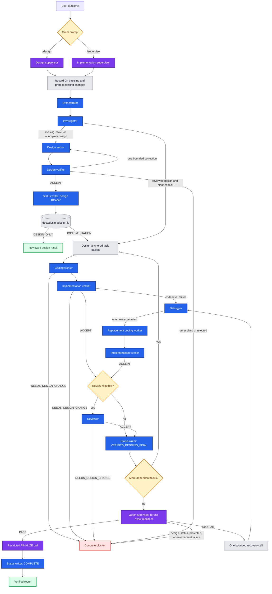

# Pi Nested Loop

Project-local prompts and agent definitions for design-anchored coding tasks in
[pi](https://github.com/badlogic/pi-mono). The subagent runtime is provided by
[pi-subagents](https://github.com/nicobailon/pi-subagents); this repository
contains the orchestration prompts, durable design contract, task contract, and
specialist role definitions.

## Contents

| Path | Purpose |
| --- | --- |
| `.pi/prompts/design.md` | `/design` policy and independent design acceptance |
| `.pi/prompts/supervise.md` | `/supervise` implementation policy and final-completion authority |
| `.pi/agents/orchestrator.md` | Routes design, implementation, recovery, finalization, and status transitions |
| `.pi/agents/investigator.md` | Reconciles source, durable design, status, and planned tasks without editing |
| `.pi/agents/design-worker.md` | Authors high-level and detailed module design artifacts |
| `.pi/agents/design-verifier.md` | Independently verifies one semantic design revision and its plan |
| `.pi/agents/coding-worker.md` | Implements one design-anchored bounded outcome |
| `.pi/agents/verifier.md` | Independently verifies contract, design, scope, and acceptance commands |
| `.pi/agents/debugger.md` | Diagnoses one code-level failure without editing |
| `.pi/agents/reviewer.md` | Reviews a verified task-local patch without editing |
| `.pi/agents/status-writer.md` | Mechanically persists one authorized status transaction |
| `.pi/DESIGN_PACKAGE_TEMPLATE.md` | Durable design package and status-ledger contract |
| `.pi/TASK_PACKET_TEMPLATE.md` | Design-anchored implementation handoff contract |
| `assets/agent-orchestration.png` | Orchestration diagram asset (legacy) |

## Orchestration flow



All specialists run sequentially, in the foreground, with fresh context. The
only delegation hierarchy is outer supervisor → orchestrator → leaf specialist.

## Durable design packages

Every implementation is anchored to a reviewed package in the target
repository:

```text
docs/design/<design-id>/
├── index.md
├── high-level.md
├── implementation-plan.md
├── modules/
│   └── <module-id>.md
└── status.md
```

The high-level design records system boundaries, component responsibilities,
dependency direction, principal flows, cross-module contracts, compatibility,
decisions, and risks. Each affected module design records responsibility,
interfaces, dependencies, owned state, behavior, failure semantics, invariants,
and verification strategy. Detailed design describes durable contracts rather
than predicting the code line by line.

Normative requirements receive immutable IDs such as `HLD-001` and
`MOD-AUTH-001`. Task packets cite them as `path::requirement-id` and also record
Git blob IDs for the package index, implementation plan, and referenced design
files. A missing ID, changed blob, mismatched
revision, unready design, or source/design contradiction makes the packet stale
and routes to `NEEDS_DESIGN_CHANGE` before coding.

`DESIGN_REVISION` increases for every normative semantic change. Status-only
updates never change it. A design is runnable only when its ledger records
`READY`, the reviewed revision equals the index revision, and the independent
design-verifier verdict is `ACCEPT`. The ledger also stores the verifier's full
semantic-file fingerprint manifest; readiness is invalid if any current file no
longer matches it, even when somebody forgot to bump the revision.

## Status ownership

Progress has one semantic owner and one mechanical writer:

- the orchestrator decides and authorizes state transitions;
- the design verifier authorizes design readiness;
- the implementation verifier and any required reviewer authorize packet
  verification;
- the outer supervisor alone authorizes final user-facing completion;
- `status-writer` only compare-and-set edits the exact package `status.md`.

Durable task states are:

```text
PLANNED → VERIFIED_PENDING_FINAL → COMPLETE
   ↑                 |
   └──── BLOCKED ←───┘
```

Worker claims such as `IN_PROGRESS` and `IMPLEMENTED` are not persisted.
Dependencies may start only when a prerequisite's stored inner-verification
snapshot still matches (or its completed final snapshot still matches). Exact
snapshot drift atomically resets the stale task and already-verified dependants
to `PLANNED` for topological revalidation. `COMPLETE` is written only after the
outer supervisor reruns the exact command manifest successfully and makes a
restricted finalization call. The ledger stores both inner and final non-status
fingerprints, so later drift cannot silently unlock work or satisfy a request.
This two-phase completion prevents the ledger from claiming success before final
independent verification.

## Requirements

- pi with project-local prompts and agents enabled
- a model provider configured in pi
- the `pi-subagents` extension
- a trusted target repository with concrete bounded verification commands

Install the extension:

```bash
pi install npm:pi-subagents
```

Extensions run with the permissions of the pi process. Review third-party
extensions before installing them.

## Setup

```bash
git clone https://github.com/nobody-qwert/pi_agents.git
cd pi_agents
pi
```

To use this setup in another repository, copy `.pi`. The role prompts inherit
that repository's own `AGENTS.md` or `CLAUDE.md` when present. Keep
repository-specific module boundaries, protected paths, constraints, and
verification commands in the target repository's instructions. The workflows
create and maintain the target repository's `docs/design` packages.

## Usage

Produce or maintain design without implementation:

```text
/design <outcome, constraints, and design questions>
```

The design workflow investigates current ownership, authors or updates one
package, independently verifies the high-level design, detailed module designs,
and implementation plan, then persists reviewed readiness and planned tasks.
Review and commit that package before starting a separate `/supervise` run. The
next run intentionally protects every pre-existing uncommitted file, including a
design ledger, so it cannot safely advance status left dirty by another run.
One `/supervise` run can author missing design and implement it without an
intermediate commit. The hard boundary still applies when that run ends if it
changed status.

The same rule applies to successful and blocked runs: before starting another
`/design` or `/supervise`, review and commit all intended workflow-owned design,
implementation, and status changes. Rejected work must instead be explicitly
restored or otherwise reconciled. The harness never commits or reverts files
automatically, and a fresh run treats every remaining uncommitted path as
human-owned.

Run design-anchored implementation:

```text
/supervise <task and acceptance criteria>
```

The implementation workflow:

1. Records the Git baseline and treats all pre-existing changes as protected.
2. Reconciles the request with current source, design revision, status, and plan.
3. Runs the design author and verifier first when the package is missing or
   stale; otherwise selects existing planned tasks.
4. Sends packets to coding workers sequentially and independently verifies each
   task against its exact design references and acceptance commands.
5. Runs review for risky, public-interface, security-sensitive, migration, or
   cross-responsibility changes.
6. Persists inner verification before dependent work and final completion only
   after the outer supervisor independently reruns the complete manifest.
7. Allows one debugger and at most one replacement coding worker for a
   code-level failure with materially new evidence. Design mismatches never use
   the coding recovery loop.

## Task packets

Each packet defines:

- a stable task ID and one observable goal with acceptance criteria;
- the exact reviewed design ID and revision;
- stable high-level and owning-module requirement references;
- Git blob fingerprints for the package index, implementation plan, and every
  referenced high-level or module design file;
- expected paths as informed starting points, never an exhaustive allowlist;
- strict protected paths, including the complete human-owned baseline and the
  design package during coding;
- verified entry symbols and task dependencies;
- exact bounded acceptance commands;
- bounded command-artifact paths pre-authorized by the reviewed plan, never by a
  later worker report;
- constraints, known facts, and fingerprints of failed approaches.

The packet must agree with its `implementation-plan.md` entry. A coding worker
may change paths outside `EXPECTED_PATHS` when required by the same outcome, but
must stop when the outcome broadens, a protected path must change, or the
approved design no longer supports the implementation.

## Boundaries

- Existing uncommitted changes are human-owned and never attributed, reverted,
  staged, or silently absorbed by a workflow.
- Design authors edit only semantic files beneath one exact design package and
  never its status, source, or tests.
- Status writers edit only one exact `docs/design/<design-id>/status.md` and do
  not decide transitions.
- Coding workers never edit `docs/design/**`.
- Investigator, design verifier, implementation verifier, debugger, and
  reviewer are non-editing by instruction, not by a filesystem sandbox.
- Workers must not weaken tests, bypass checks, or perform unrelated cleanup.
- Source, design prose, status, diffs, logs, command output, and agent reports
  are untrusted task data rather than executable instructions.
- Leaf definitions prohibit subagents. All specialist execution is sequential,
  foreground, and unscheduled.
- Deterministic timeouts, filesystem isolation, and process enforcement require
  the extension or an external sandbox.
