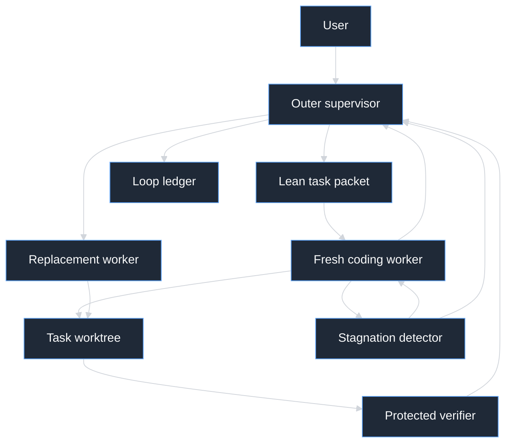
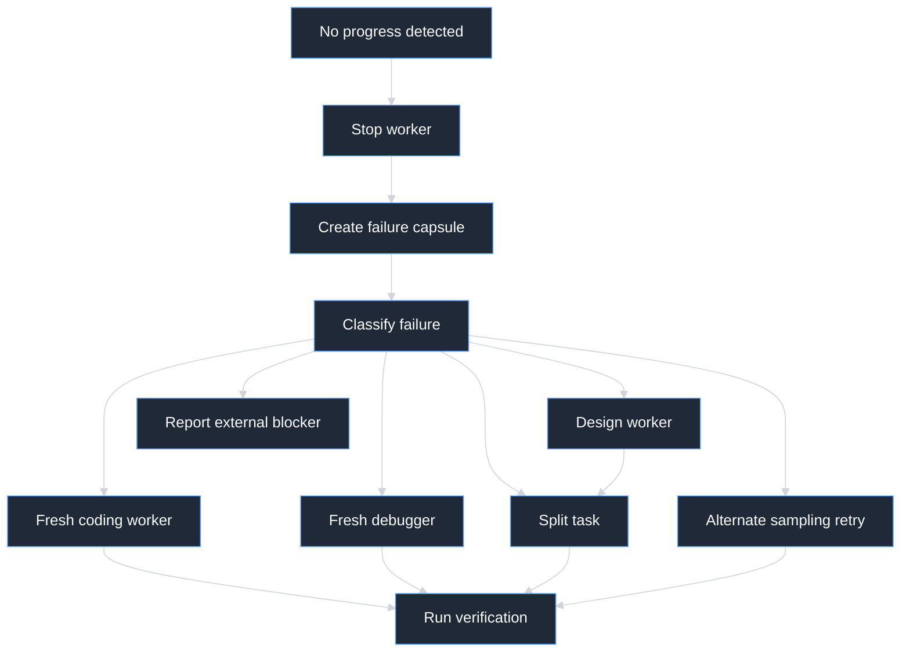
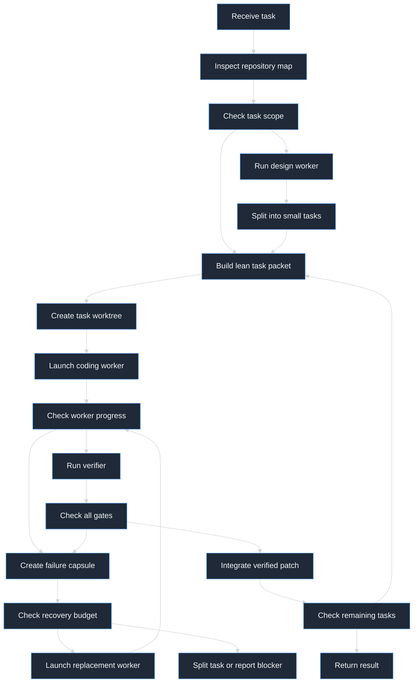

# Local pi Supervisor with Lean Coding Subagents

This is the setup and usage guide for running pi with a local LM Studio model, an outer supervisor, and lean isolated coding subagents.

## Current status

This repository currently contains the Markdown instruction layer:

```text
AGENTS.md
.pi/agents/coding-worker.md
.pi/agents/debugger.md
.pi/agents/design-worker.md
.pi/agents/reviewer.md
.pi/prompts/supervise.md
.pi/settings.json
.pi/TASK_PACKET_TEMPLATE.md
```

The executable subagent extension is not stored inside this repository. On this machine, however, `npm:pi-subagents` version `0.34.0` is already installed globally through `~/.pi/agent/settings.json`, so pi can launch these project agents after it reloads the trusted project configuration. A different machine must install the package separately.

The project-local `.pi/settings.json` constrains the installed extension to this one LM Studio model and one concurrent subagent task.

## One GPU and one loaded model

Subagents are separate **pi processes and context windows**, not separate LM Studio model instances.

The intended sequence is:

```text
outer pi sends request to LM Studio
outer generation ends with a subagent tool call
extension starts one child pi process
child pi sends requests to the same LM Studio endpoint and model
child finishes and exits
outer pi resumes using the same loaded model
```

At no point should the outer and child pi processes generate concurrently. The parent is waiting for the subagent tool result while the child uses LM Studio.

This was verified against the live local server on 2026-07-10:

```text
LM Studio endpoint: http://127.0.0.1:1234/v1
Requested model key: qwen3.6-27b@q4_k_m
Loaded instance before request: qwen3.6-27b
Loaded instance after request:  qwen3.6-27b
Loaded instance count after request: 1
Quantization: Q4_K_M, 4 bits per weight
Loaded context length: 60160
```

LM Studio reused the existing instance. It did not load a second copy. LM Studio's documented model lookup behavior is to return the existing instance when the requested model key is already loaded; loading another instance requires an explicit model-load operation or a different model identifier.

### Required single-3090 safeguards

Apply these settings before relying on the workflow:

1. Manually load `qwen3.6-27b@q4_k_m` once in LM Studio.
2. In LM Studio Developer server settings, turn **JIT model loading off**. A wrong model ID will then fail instead of loading another model automatically.
3. Reload the model with **Max Concurrent Predictions = 1**. The current live instance reports `parallel: 4`. That is one set of model weights, not four model copies, but limiting it to one prevents overlapping KV-cache allocations and accidental concurrent generation.
4. Keep all role files pinned to `model: lmstudio/qwen3.6-27b@q4_k_m`.
5. Keep pi's default provider and model set to the same LM Studio entry.
6. Use only the subagent tool's **single** mode. Do not expose or invoke its parallel `tasks` mode.
7. Do not call LM Studio's model-load API from the supervisor extension or worker extension.
8. Do not use a speculative draft model on this 24 GB setup.

Check the loaded state before a long run:

```bash
lms ps
```

Or query the server:

```bash
curl -sS http://127.0.0.1:1234/api/v1/models
```

There should be exactly one entry under `loaded_instances` for `qwen3.6-27b@q4_k_m`.

### Why separate contexts do not duplicate weights

Each child pi process gets a new conversation history so it can focus on a lean task. That history is sent as another HTTP request to the already running LM Studio server. The large 27B model weights remain owned by the single LM Studio process. Only request-specific prompt processing and KV cache change between supervisor and worker calls.

Sequential execution is still important. Two simultaneous requests can share one model instance through continuous batching, but they need separate active KV caches and reduce the predictability of latency and VRAM usage. This setup deliberately avoids that mode.

## Install this setup in another project

There are two good arrangements. The recommended one keeps reusable executable code global and project rules local.

### Recommended: global extension, project-local instructions

Install the subagent extension once through pi:

```bash
pi install npm:pi-subagents
```

The installed package is [pi-subagents](https://github.com/nicobailon/pi-subagents). Review it before installing because pi extensions execute with your user permissions. Pi also has a smaller official [subagent example](https://github.com/earendil-works/pi/tree/main/packages/coding-agent/examples/extensions/subagent), but this machine is using the npm package.

The installed `pi-subagents` package supports single, chain, parallel, background, and scheduled modes. For this 3090 setup, use only this foreground form:

```json
{
  "agent": "coding-worker",
  "task": "lean task packet",
  "agentScope": "project",
  "context": "fresh",
  "async": false
}
```

The project `.pi/settings.json` sets `parallel.maxTasks`, `parallel.concurrency`, and `globalConcurrencyLimit` to `1`, so even an accidental multi-task request cannot run several child model calls concurrently. The supervisor instructions also prohibit background and async runs, because a background child could overlap with a later parent request.

Then copy the instruction layer into each target project:

```bash
SOURCE=/home/sandor/proj/pi_nested_loop
TARGET=/path/to/your/project

mkdir -p "$TARGET/.pi/agents" "$TARGET/.pi/prompts"
cp "$SOURCE/AGENTS.md" "$TARGET/AGENTS.md"
cp "$SOURCE/.pi/agents/"*.md "$TARGET/.pi/agents/"
cp "$SOURCE/.pi/prompts/supervise.md" "$TARGET/.pi/prompts/"
cp "$SOURCE/.pi/settings.json" "$TARGET/.pi/"
cp "$SOURCE/.pi/TASK_PACKET_TEMPLATE.md" "$TARGET/.pi/"
```

Before running pi, customize the copied files:

1. Update `AGENTS.md` with that repository's real module map, protected paths, and verification commands.
2. Confirm the `model:` entry in every `.pi/agents/*.md` matches a model shown by `pi --list-models`.
3. Keep the Qwen model entry if the target machine uses `lmstudio/qwen3.6-27b@q4_k_m`.
4. Remove irrelevant rules rather than growing `AGENTS.md`; it is automatically placed in model context.
5. Trust project-local agents only in repositories whose contents you trust.

Start from the target project root:

```bash
cd /path/to/your/project
pi
```

Inside pi, start a supervised task with:

```text
/supervise describe the coding task here
```

The subagent invocation should use `agentScope: "project"` or `agentScope: "both"`; otherwise the extension will not discover `.pi/agents/*.md`. It must also use `context: "fresh"` and `async: false` for this workflow.

### Fully project-local installation

To make a repository self-contained, also put the extension in the project:

```text
your-project/
├── AGENTS.md
└── .pi/
    ├── agents/
    ├── prompts/
    ├── extensions/
    │   └── subagent/
    │       ├── index.ts
    │       └── agents.ts
    └── TASK_PACKET_TEMPLATE.md
```

Pi auto-discovers `.pi/extensions/*/index.ts` after the project is trusted. This arrangement is easier to reproduce but duplicates extension code across repositories, so updates must be copied to each project.

### What is required and what is optional

| Item | Required | Purpose |
|---|---|---|
| `AGENTS.md` | Yes | Shared repository rules loaded automatically by pi and child pi processes |
| `.pi/agents/coding-worker.md` | Yes | Defines the implementation subagent |
| `.pi/agents/debugger.md` | Recommended | Provides a clean diagnostic context after a stuck worker |
| `.pi/agents/design-worker.md` | Recommended | Splits broad work before implementation |
| `.pi/agents/reviewer.md` | Optional | Independently reviews risky patches |
| `.pi/prompts/supervise.md` | Yes for `/supervise` | Gives the outer pi session its orchestration protocol |
| `.pi/settings.json` | Yes for one-GPU enforcement | Pins the model and caps extension concurrency to one |
| `.pi/TASK_PACKET_TEMPLATE.md` | Optional | Human and extension reference; it is not automatically loaded |
| Subagent TypeScript extension | Yes | Registers the tool and launches isolated pi subprocesses |
| Worker-guard extension | Required for hard enforcement | Detects repetition, counts non-progress, and aborts stuck workers |

Markdown instructions guide the model. Only extension code can enforce timeouts, block writes, inspect event streams, or terminate a repeating generation.

## Mermaid preview in VS Code

The diagrams in this guide use legacy-safe Mermaid `graph` syntax without HTML, quoted labels, or labeled branches.

If a diagram still appears blank, open VS Code's built-in **Markdown: Open Preview to the Side** command. If your VS Code build does not provide Mermaid rendering, install or enable a trusted Mermaid Markdown-preview extension. A blank diagram in that case is a preview capability problem, not a Markdown fence problem.

## Goal

Build a fully local coding workflow around the existing setup:

- one RTX 3090;
- Qwen 3.6 27B Q4 served by LM Studio;
- pi as the interactive outer supervisor;
- fresh pi subprocesses as coding workers;
- automated detection of repetition and unproductive repair loops;
- small, deliberately constructed context for every worker;
- tests and repository rules that encourage modular code.

The desired behavior is:

> The supervisor understands the task, creates one narrow work packet, delegates it to a fresh coding worker, verifies the result, and replaces or redirects the worker if it becomes stuck.

This plan targets the locally installed pi `0.80.3`. The existing provider configuration is already correct in the important respects: it uses `openai-completions`, points to `http://127.0.0.1:1234/v1`, and disables unsupported developer-role and reasoning-effort behavior.

## Why the current agent can get trapped

A never-ending repair loop is usually not caused by temperature alone. Several failure modes reinforce each other:

1. **Context contamination:** the model sees every previous attempt, error, theory, and large tool result. Old mistakes become suggestions for the next attempt.
2. **Deterministic fixation:** a low-temperature model can repeatedly choose its highest-probability repair even after that repair has failed.
3. **Sampling degeneration:** unsuitable sampling can produce literal repeated text or malformed tool calls.
4. **No progress model:** the harness sees activity but does not distinguish productive activity from the same edit-test-fail cycle.
5. **Task scope is too large:** the model tries to hold the architecture, implementation, debugging, and validation in one context.
6. **Weak verifier:** if success is described in prose instead of executable checks, the agent cannot reliably know when it is done.
7. **Large modules:** a change in one oversized file requires too much unrelated context and produces broad, fragile patches.

The solution therefore needs four controls, not one magic inference setting:

- context isolation;
- objective verification;
- stagnation detection and recovery;
- architectural constraints that keep future tasks small.

## Proposed architecture



The supervisor and worker may use the same Qwen model, but they should not infer concurrently. LM Studio has one model on one GPU; concurrent pi subprocesses would compete for the same KV cache, VRAM, and generation throughput. Start with exactly one active LLM request at a time.

## Role boundaries

### Outer supervisor

The outer pi session owns coordination, not implementation. It should:

- clarify and decompose the user goal;
- inspect repository structure at a high level;
- select one module-sized change;
- create a lean task packet;
- launch one worker;
- receive only the worker's structured summary;
- run or inspect independent verification;
- detect stagnation and decide the recovery action;
- integrate a verified patch or reject it;
- keep the global task ledger.

The supervisor should normally not edit production source. Keeping it out of implementation prevents its long orchestration context from leaking into coding decisions.

### Inner coding worker

Every worker is a new pi process with a fresh session and isolated context. It should:

- receive one bounded task;
- discover only the relevant code with `rg`, symbol search, and targeted reads;
- make the smallest coherent implementation;
- run the named checks;
- stop with a structured result;
- never broaden scope without returning `BLOCKED_SCOPE` to the supervisor.

### Fixed verifier

The verifier is code and commands, not another model's opinion. It should include, where available:

- focused tests for the changed module;
- full tests at the integration gate;
- type checking;
- linting or formatting;
- build or packaging checks;
- a changed-files allowlist;
- an architectural boundary check.

Neither supervisor nor worker may weaken the verifier to make a task pass.

## Pi extension layer

This machine already has [pi-subagents](https://github.com/nicobailon/pi-subagents) `0.34.0` installed globally. It spawns separate pi child sessions and discovers the project agent definitions in `.pi/agents/`. The project settings restrict its model selection and concurrency for one-GPU use.

Pi also includes a smaller official [subagent example extension](https://github.com/earendil-works/pi/tree/main/packages/coding-agent/examples/extensions/subagent), but it is not the extension currently registered in `~/.pi/agent/settings.json`.

The remaining custom extension work is the deterministic worker guard: streaming repetition detection, normalized-error counting, path enforcement, and forced termination after non-progress. Markdown can request those behaviors but cannot enforce them.

### Instruction files already scaffolded

The project now contains the Markdown control layer:

| File | Loaded by | Responsibility |
|---|---|---|
| `AGENTS.md` | Supervisor and every worker | Shared repository, modularity, verification, and failure rules |
| `.pi/prompts/supervise.md` | Outer pi via `/supervise <task>` | Supervisor workflow and delegation policy |
| `.pi/agents/coding-worker.md` | Subagent extension | Narrow implementation role with an explicit stop/report contract |
| `.pi/agents/debugger.md` | Subagent extension | Fresh read-only diagnosis after a stuck worker |
| `.pi/agents/design-worker.md` | Subagent extension | Read-only decomposition of broad work |
| `.pi/agents/reviewer.md` | Subagent extension | Independent patch review without the coding transcript |
| `.pi/TASK_PACKET_TEMPLATE.md` | Supervisor or extension | Lean handoff schema; not automatically loaded into context |

These files specify intent. They do not themselves spawn subprocesses, enforce path permissions, interrupt repeated generation, or count progress. Those behaviors belong in the extensions below.

### 1. Optional hardened `local-supervisor` wrapper

Location during development:

```text
<project>/.pi/extensions/local-supervisor/
```

Suggested modules:

```text
.pi/extensions/local-supervisor/
├── index.ts
├── task-packet.ts
├── worker-runner.ts
├── event-parser.ts
├── stagnation.ts
├── verifier.ts
├── ledger.ts
├── git-boundary.ts
└── ui.ts
```

If hard rejection of `async: true` is required, register a smaller wrapper tool around `pi-subagents` RPC with a single model-facing action:

```text
delegate_coding_task
```

Its input should be structured and intentionally small:

```json
{
  "goal": "Add validation for empty widget names",
  "allowed_paths": ["src/widget/", "tests/widget/"],
  "entry_symbols": ["WidgetService.create"],
  "acceptance_commands": ["npm test -- widget", "npm run typecheck"],
  "constraints": ["Do not change the public API"],
  "known_failed_approaches": []
}
```

Do not expose generic parallel delegation initially. With one local model and one GPU, parallel subprocesses add contention without adding intelligence.

### 2. `worker-guard` extension

Load this extension inside every worker subprocess. It watches tool and message events and maintains a small progress state. Pi extensions can subscribe to tool events, inspect session state, inject messages, persist extension-only state, and abort an active turn. The current extension API is documented in pi's [extension guide](https://github.com/earendil-works/pi/blob/main/packages/coding-agent/docs/extensions.md).

The guard should:

- fingerprint tool calls and normalized errors;
- track changed files and diff size;
- track which acceptance checks have changed state;
- detect repeated assistant text while it is streaming;
- warn once with concrete evidence;
- abort after a hard threshold;
- write a machine-readable worker report.

The worker guard must not ask the same model whether it is stuck. Detection should be deterministic.

### 3. `lean-tools` extension

Either wrap noisy shell commands or enforce output budgets in the worker prompt. Pi's extension documentation recommends truncating tool output because large results degrade context quality.

Recommended worker limits:

- ordinary tool result: 200 lines or 12 KB;
- failed-test result: retain the final failure summary and stack trace, not the entire build log;
- file read: targeted ranges, not whole large files;
- search result: at most 50 matches before narrowing the query;
- worker final report: at most 2 KB plus paths to artifacts.

Store complete logs under `.pi/loop/runs/<run-id>/`; return only their paths and relevant tail excerpts to the model.

## The lean task packet

The supervisor must not copy its conversation into the worker prompt. The packet should normally remain below roughly 1,500 tokens and contain only:

```text
TASK ID
One-sentence goal

ACCEPTANCE CRITERIA
Observable behavior and exact commands

SCOPE
Allowed directories and likely entry symbols

CONSTRAINTS
Public interfaces, compatibility, forbidden changes

KNOWN FACTS
Only facts proven by repository inspection

KNOWN FAILED APPROACHES
Short fingerprints, not full transcripts

OUTPUT CONTRACT
Status, files changed, checks run, unresolved risk
```

Do not paste source blobs into the packet. Give the worker paths and symbols, then let its fresh context read only what it needs. A small local model generally performs better when it performs targeted retrieval itself than when it receives a large, preassembled wall of code.

## Stagnation detection

### Progress signals

Each worker action updates a progress vector:

```text
P = {
  test_state,
  normalized_error,
  diff_hash,
  changed_files,
  completed_acceptance_items,
  tool_fingerprint,
  response_suffix_fingerprint
}
```

Activity counts as progress only when at least one meaningful field improves or changes in a relevant way. Another edit followed by the identical failure is activity, not progress.

### Initial stuck rules

Use conservative, explainable thresholds:

| Signal | Warning | Abort worker |
|---|---:|---:|
| Identical normalized error | 2 consecutive occurrences | 3 occurrences |
| Same tool call with equivalent arguments | 2 occurrences | 3 occurrences |
| Same file repeatedly edited with unchanged test failure | 3 edits | 5 edits |
| No acceptance-state improvement | 6 tool calls | 10 tool calls |
| Worker turn budget | 8 turns | 12 turns |
| Literal generated-text repetition | 2 matching long suffixes | 3 matching suffixes |
| Wall-clock budget for a small task | 15 minutes | 25 minutes |

These values are starting hypotheses. Record their false positives and tune them using real sessions.

Normalize errors before comparison by removing timestamps, temporary paths, line-number drift, random IDs, and timing values. Otherwise the same failure will appear different every run.

### Repeated-text detector

For generation degeneration, maintain a rolling character or token window over streamed assistant output:

1. ignore code syntax that naturally repeats, such as braces and indentation;
2. compare suffix blocks of approximately 80 to 200 characters;
3. require a meaningful alphanumeric payload;
4. warn after the same block appears twice nearby;
5. abort generation after the third repetition;
6. classify the outcome as `REPETITION_ABORT`, not a coding failure.

This extension must run in the child process because the parent supervisor sees only the child's captured output after launch. Alternatively, the custom worker runner can parse pi's JSON event stream and terminate the child from outside; using both provides defense in depth.

## Recovery ladder

When a worker is stuck, do not continue feeding it more instructions in the polluted context.



The failure capsule should contain:

- the goal;
- current diff summary;
- exact failing command;
- normalized error;
- approaches already tried, one line each;
- why the guard declared stagnation;
- paths to full logs.

It should not contain the old worker's chain of thought or full transcript.

Allow at most two replacement workers for one unchanged task packet. After that, the supervisor must split the task, change the architecture, or ask the human for missing information. Repeatedly respawning the same task is merely a more expensive loop.

## Making the code modular

Prompting the model to "write modular code" is too vague. Make modularity visible and testable.

### Repository contract

Add a short project-level `AGENTS.md` containing:

- a map of top-level modules and their responsibilities;
- permitted dependency direction;
- where interfaces, implementations, and tests belong;
- commands for focused and full verification;
- explicit forbidden shortcuts;
- a rule to extend an existing responsibility before creating a new abstraction.

Keep it compact because every pi process will read it.

### Task contract

Before delegation, the supervisor identifies:

- the owning module;
- the public interface affected;
- the smallest independently testable behavior;
- the expected files;
- forbidden unrelated refactoring.

If these cannot be stated clearly, the task is not ready for a coding worker. Delegate a read-only architecture investigation first.

### Automated architecture checks

Prefer checks appropriate to the language, such as:

- forbidden-import rules;
- dependency-cycle detection;
- public API tests;
- maximum complexity warnings;
- duplicate-code detection;
- changed-files allowlist;
- warnings for unusually large new modules or functions.

Line limits should be warnings rather than absolute laws. A 300-line cohesive parser may be healthier than six artificial wrapper files. The hard gate should be responsibility and dependency direction.

### Two-stage implementation for complex work

For a large feature, use separate fresh workers:

1. **Design worker:** read-only, produces module boundaries, interfaces, invariants, and a sequence of small tasks.
2. **Coding worker:** receives exactly one approved task and the relevant design fragment.
3. **Verifier:** executes objective checks.
4. **Review worker, only when risk warrants it:** sees the diff and acceptance contract, not the coding transcript.

This separation gives a 27B model several small problems instead of one enormous problem.

## LM Studio inference plan

LM Studio exposes `temperature`, `top_p`, `top_k`, `min_p`, `repeat_penalty`, output-token, reasoning, and context controls in its native API. Its current parameter definitions are in the [LM Studio chat API documentation](https://lmstudio.ai/docs/developer/rest/chat). Pi connects through the OpenAI-compatible endpoint, so confirm which settings appear in the final request and which are supplied by the loaded LM Studio preset.

### Do not tune by intuition

Create a local evaluation set of 10 to 20 previously troublesome coding tasks. Record:

- task completion rate;
- first-pass test success;
- tool-call validity;
- repeated-text aborts;
- stagnation aborts;
- total generated tokens;
- wall-clock time;
- number of replacement workers.

Change one sampling variable at a time and repeat each configuration several times. A setting that fixes one anecdotal loop may reduce tool reliability elsewhere.

### Starting profiles to test

These are experiments, not guaranteed optimal values:

| Profile | Temperature | Top-p | Repeat penalty | Use |
|---|---:|---:|---:|---|
| Stable coding | 0.15 | 0.90 | 1.03 | Default implementation worker |
| Alternate repair | 0.30 | 0.92 | 1.05 | One retry after deterministic fixation |
| Design exploration | 0.45 | 0.95 | 1.03 | Read-only architecture worker |

Important cautions:

- Temperature `0` can make a bad repair perfectly repeatable.
- High temperature can damage structured tool calls.
- A high repeat penalty can corrupt code, JSON, identifiers, and necessary repeated syntax.
- Do not change sampling mid-worker. Kill the stuck worker and start a clean one with the alternate preset.
- Keep one alternate retry only; sampling diversity is not a substitute for decomposition.

The current pi model entry allows up to 16,384 output tokens. For worker calls, test a lower effective cap such as 4,096 to 8,192. Long uninterrupted generations make degeneration more costly and are usually unnecessary when the agent has tools.

Although the model is registered with a 60k context window, treat that as an emergency ceiling. Aim for worker prompts plus tool history below roughly 20k to 30k tokens, then terminate or compact. The entire purpose of fresh subagents is to avoid using the full context as a storage bin.

### Request-profile extension

If pi's model configuration does not expose the desired sampling fields, a small extension can use the `before_provider_request` hook to apply a named worker profile to the outgoing LM Studio payload. It should also log the effective non-secret parameters for reproducibility.

Do not hard-code one global temperature. Select a profile when launching the subprocess:

```text
PI_AGENT_ROLE=worker-stable
PI_AGENT_ROLE=worker-alternate
PI_AGENT_ROLE=design
PI_AGENT_ROLE=supervisor
```

The request hook reads the role and applies the associated bounded parameter set.

## State and observability

Keep orchestration state outside the LLM context:

```text
.pi/loop/
├── state.json
├── tasks.jsonl
├── interventions.jsonl
├── sampling-results.tsv
└── runs/
    └── <run-id>/
        ├── packet.md
        ├── worker-events.jsonl
        ├── worker-report.json
        ├── test.log
        ├── diff.patch
        └── failure-capsule.md
```

The supervisor receives summaries from these files. It should read full logs only when diagnosing a specific failure.

Each intervention record should answer:

- what stagnation rule fired;
- what evidence triggered it;
- which recovery action was chosen;
- whether that action eventually improved the result;
- token and time cost.

This data is what later allows an outer loop to improve the inner loop instead of merely restarting it.

## Git and filesystem safety

For the prototype, require a clean repository and run only one worker at a time. Before a worker starts:

1. record the base commit and existing status;
2. create a task branch or isolated worktree;
3. enforce `allowed_paths` in an extension tool gate;
4. preserve the patch and logs on failure;
5. integrate only after verification passes.

An isolated git worktree per task is preferable for mature use. It prevents a replacement worker from inheriting half-finished files and protects the user's main working tree. The supervisor should never use destructive resets against uncommitted human work.

## End-to-end control flow



## Delivery phases

### Phase 0: Baseline measurements

- Select 10 representative tasks, including known repetition failures.
- Run current pi without subagents.
- Save success, tokens, time, repeated output, and repair-loop counts.
- Freeze the LM Studio model file and record its exact preset.

Exit criterion: a baseline table exists and at least two failure cases are reproducible.

### Phase 1: Lean isolated worker

- Adapt pi's official subagent example to a single `delegate_coding_task` tool.
- Pin the child to the same provider and model.
- Pass only the task packet and working directory.
- Limit returned output to a structured 2 KB report.
- Disable parallel and chain modes.

Exit criterion: the parent session delegates five tasks without sending its transcript, and every child has an independent context/session.

### Phase 2: Objective verification and scope guard

- Add acceptance commands to the packet schema.
- Add an allowed-path write gate.
- Save full logs outside model context.
- Reject changes that touch protected files or weaken tests.

Exit criterion: an intentionally out-of-scope edit and an intentionally broken test are both rejected automatically.

### Phase 3: Stagnation and repetition guard

- Add event fingerprints and normalized-error comparison.
- Add streaming repeated-text detection.
- Add turn, tool-call, token, and wall-clock limits.
- Generate failure capsules on abort.

Exit criterion: reproduced loops terminate within their limits and retain enough evidence for a fresh worker to continue.

### Phase 4: Supervisor recovery

- Classify stuck outcomes.
- Launch a debugger, design, or alternate-sampling worker as appropriate.
- Enforce the two-replacement budget.
- Compare recovery success with simply continuing the original context.

Exit criterion: recovery improves success rate on the baseline suite without increasing median cost beyond the chosen budget.

### Phase 5: Modularity gates

- Add the concise project architecture contract.
- Add language-specific dependency and complexity checks.
- Require design-first decomposition for cross-module tasks.
- Add an optional fresh review worker for high-risk diffs.

Exit criterion: workers consistently produce module-sized patches and architectural violations fail before integration.

### Phase 6: Sampling evaluation

- Implement named request profiles.
- Run the same evaluation set across profiles.
- Choose separate stable-coding and alternate-repair presets.
- Keep the repetition guard regardless of the winning preset.

Exit criterion: the chosen profiles outperform the original settings across repeated runs, not just one example.

## Success metrics

The system is successful if, on the fixed evaluation set:

- more tasks pass all acceptance checks;
- fewer sessions exceed the repair-loop threshold;
- repeated text is stopped quickly;
- median worker context is substantially smaller;
- patches touch fewer unrelated modules;
- replacement workers solve a meaningful fraction of stuck cases;
- total wall-clock and token cost stay within an explicit budget;
- the supervisor never silently accepts an unverified patch.

Do not optimize only for number of completed tasks. Also measure regressions, diff scope, architecture violations, and human review burden.

## Recommended first implementation

Start with this minimal vertical slice:

1. one outer pi supervisor;
2. one `delegate_coding_task` extension based on pi's subagent example;
3. one fresh, sequential worker using the same Qwen model;
4. a task packet capped near 1,500 tokens;
5. exact acceptance commands;
6. a hard limit of 10 tool calls or 12 turns without meaningful progress;
7. normalized repeated-error detection;
8. a 2 KB structured worker result;
9. one fresh debugger retry;
10. no dynamic mechanism generation and no parallel agents yet.

This small version directly addresses the current failure: a worker cannot loop forever, and a replacement does not inherit the bloated context that caused the fixation. Once it works on real repositories, the outer supervisor can become more sophisticated using evidence from the ledger.

## Sources

- [Pi extension documentation](https://github.com/earendil-works/pi/blob/main/packages/coding-agent/docs/extensions.md)
- [Pi subagent example](https://github.com/earendil-works/pi/tree/main/packages/coding-agent/examples/extensions/subagent)
- [Pi custom model configuration](https://github.com/earendil-works/pi/blob/main/packages/coding-agent/docs/models.md)
- [Pi package installation and project-local packages](https://github.com/earendil-works/pi/blob/main/packages/coding-agent/docs/packages.md)
- [LM Studio local API and inference parameters](https://lmstudio.ai/docs/developer/rest/chat)
- [LM Studio model reuse and explicit instance loading](https://lmstudio.ai/docs/typescript/manage-models/loading)
- [LM Studio JIT loading, TTL, and auto-eviction](https://lmstudio.ai/docs/developer/core/ttl-and-auto-evict)
- [LM Studio parallel requests and continuous batching](https://lmstudio.ai/docs/app/advanced/parallel-requests)
- [Bilevel Autoresearch paper](https://arxiv.org/abs/2603.23420)
