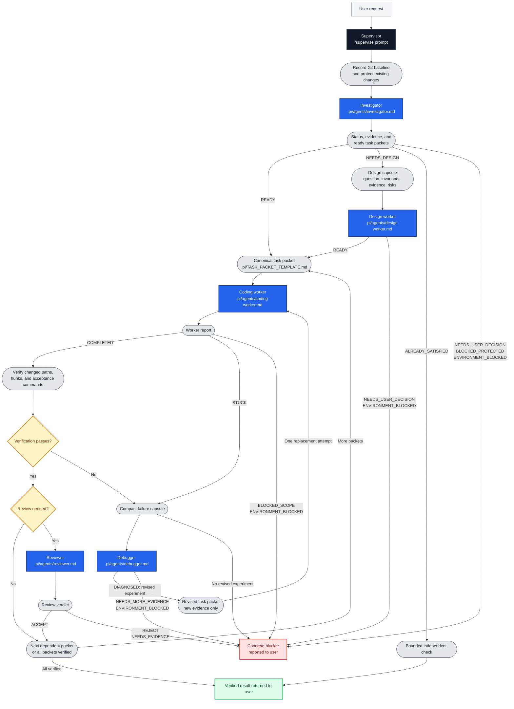

# Pi Nested Loop

Project-local prompts and agent definitions for supervising coding tasks in
[pi](https://github.com/badlogic/pi-mono). The subagent runtime is provided by
[pi-subagents](https://github.com/nicobailon/pi-subagents); this repository
contains only its project instructions and role definitions.

## Contents

| Path | Purpose |
| --- | --- |
| `AGENTS.md` | Shared repository, scope, verification, and execution rules |
| `.pi/prompts/supervise.md` | `/supervise` orchestration prompt |
| `.pi/agents/investigator.md` | Read-only repository investigation and task routing |
| `.pi/agents/design-worker.md` | Read-only resolution of architectural decisions |
| `.pi/agents/coding-worker.md` | Implementation of one bounded outcome |
| `.pi/agents/debugger.md` | Read-only diagnosis of a failed implementation attempt |
| `.pi/agents/reviewer.md` | Read-only review of a verified patch |
| `.pi/TASK_PACKET_TEMPLATE.md` | Handoff contract for implementation tasks |
| `assets/agent-orchestration.png` | Orchestration diagram asset (legacy) |

## Orchestration flow



No model, provider, concurrency, or extension settings are checked in. Configure
them in the pi environment. The project instructions require subagents to run
sequentially, in the foreground, with fresh context, and without nested
subagents.

## Requirements

- pi with project-local prompts and agents enabled
- a model provider configured in pi
- the `pi-subagents` extension
- a trusted target repository with concrete verification commands

Install the extension:

```bash
pi install npm:pi-subagents
```

Extensions run with the permissions of the pi process. Review third-party
extensions before installing them.

## Setup

```bash
git clone https://github.com/nobody-qwert/pi_agents.git
cd pi_agents
pi
```

To use this setup in another repository, copy `.pi`, then merge the relevant
rules from `AGENTS.md` into that repository's existing instructions. Do not
overwrite existing project instructions blindly. Update repository-specific
module boundaries, protected paths, constraints, and verification commands.

## Usage

From the configured repository root:

```text
/supervise <task and acceptance criteria>
```

The supervisor:

1. Records the Git baseline and treats pre-existing changes as protected.
2. Runs the investigator to locate ownership, constraints, and verification
   commands.
3. Runs the design worker only when the investigator reports `NEEDS_DESIGN`.
4. Sends ready task packets to the coding worker sequentially.
5. Checks changed paths and hunks, then independently runs every packet's
   acceptance commands.
6. Runs the reviewer after verification for large, risky, public-interface, or
   cross-responsibility changes.
7. On `STUCK` or a repeated verification failure, permits one debugger and at
   most one replacement coding worker when the diagnosis provides a materially
   different experiment.
8. Returns the verified result or a concrete blocker.

## Task packets

Each packet defines:

- one observable `GOAL` and its `ACCEPTANCE_CRITERIA`;
- `EXPECTED_PATHS` as informed starting points, not an exhaustive allowlist;
- strict `PROTECTED_PATHS` that must not change;
- verified `ENTRY_SYMBOLS` and task dependencies;
- exact `ACCEPTANCE_COMMANDS`;
- constraints, known facts, and fingerprints of failed approaches.

The coding worker may change paths outside `EXPECTED_PATHS` when required by the
same outcome, but must return `BLOCKED_SCOPE` if the outcome must broaden or a
protected path must change.

## Boundaries

- Existing uncommitted changes are human-owned.
- Workers must not weaken tests, bypass checks, or perform unrelated cleanup.
- Investigator, design, debugger, and reviewer roles are non-editing by
  instruction, not by a filesystem sandbox.
- Agent definitions set fresh context and prohibit nested subagents; the
  supervisor also prohibits parallel, background, asynchronous, and scheduled
  execution.
- Deterministic timeouts, filesystem isolation, and process enforcement require
  the extension or an external sandbox.
