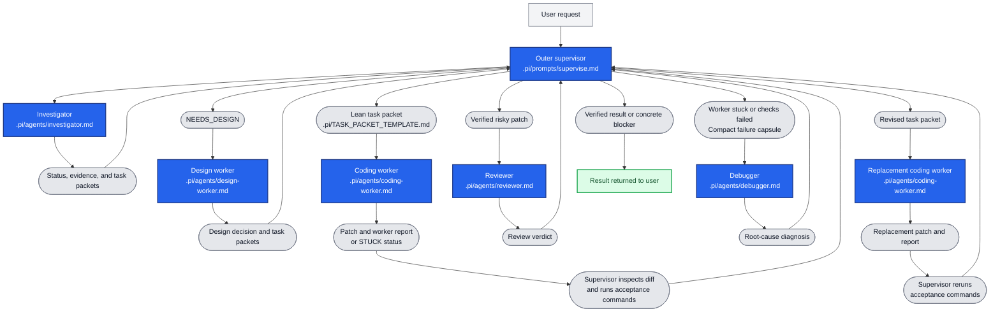

# Pi Nested Loop

Project-local configuration for supervising coding tasks with small, isolated
subagents in [pi](https://github.com/badlogic/pi-mono). The supervisor delegates
one bounded task at a time, verifies the result, and starts a fresh diagnostic
or implementation context when a worker gets stuck.

This repository contains the instruction and configuration layer. The subagent
runtime is provided separately by
[pi-subagents](https://github.com/nicobailon/pi-subagents).

## What this repository provides

- A `/supervise` prompt for status-based orchestration and verification.
- Separate roles for investigation, architectural design, implementation,
  debugging, and review.
- A compact task-packet template for reproducible handoffs.
- Shared repository rules for scope control, modularity, and test discipline.
- Sequential execution settings for environments where all agents share one
  model server.
- Explicit stop conditions for repeated failures and unproductive repair loops.

## Repository layout

```text
.
├── AGENTS.md
└── .pi/
    ├── TASK_PACKET_TEMPLATE.md
    ├── agents/
    │   ├── coding-worker.md
    │   ├── debugger.md
    │   ├── design-worker.md
    │   ├── investigator.md
    │   └── reviewer.md
    ├── prompts/
    │   └── supervise.md
    └── settings.json
```

| Path | Purpose |
| --- | --- |
| `AGENTS.md` | Shared rules loaded by the supervisor and project subagents |
| `.pi/prompts/supervise.md` | Outer-supervisor workflow exposed as `/supervise` |
| `.pi/agents/coding-worker.md` | Implements one narrow task in a fresh context |
| `.pi/agents/debugger.md` | Diagnoses a failed attempt without editing files |
| `.pi/agents/investigator.md` | Maps current behavior and returns a routing status and task packets |
| `.pi/agents/design-worker.md` | Resolves architectural decisions identified by investigation |
| `.pi/agents/reviewer.md` | Reviews a completed patch independently |
| `.pi/TASK_PACKET_TEMPLATE.md` | Schema for bounded worker handoffs |
| `.pi/settings.json` | Model allowlist and subagent concurrency limits |

## Requirements

- pi with project-local prompts and agents enabled.
- A model provider configured in pi.
- The `pi-subagents` extension.
- A trusted target repository with concrete test and build commands.

Install the subagent extension through pi:

```bash
pi install npm:pi-subagents
```

Review third-party extensions before installing them. Extensions run with the
permissions of the user running pi.

## Setup

Clone the repository and enter it:

```bash
git clone https://github.com/nobody-qwert/pi_agents.git
cd pi_agents
```

The checked-in agent definitions currently use this pi model identifier:

```text
lmstudio/qwen3.6-27b@q4_k_m
```

If your provider or model differs, update the model identifier consistently in:

- `.pi/settings.json`
- `.pi/agents/*.md`
- `.pi/prompts/supervise.md`
- `AGENTS.md`

The identifier must match one reported by:

```bash
pi --list-models
```

Keep the concurrency limits in `.pi/settings.json` at `1` when the supervisor
and workers share a model instance with limited resources. Increase them only
when the serving environment is intentionally configured for concurrent
generation.

## Use in another project

Copy the `.pi` directory into the target repository, then merge the relevant
rules from `AGENTS.md` with that repository's existing instructions. Do not
blindly overwrite an existing `AGENTS.md`.

At minimum, customize:

1. Model identifiers and provider configuration.
2. Repository module boundaries and protected paths.
3. Test, type-check, lint, and build commands.
4. Limits on worker scope, retries, and allowed files.

Trust project-local pi configuration only when you trust the repository that
contains it.

## Usage

Start pi from the root of the configured project:

```bash
pi
```

Then delegate a task with:

```text
/supervise describe the coding task and acceptance criteria
```

The expected control flow is:



Dark-blue boxes are model-driven agent roles and include their defining project
file. Gray pills are connected handoff notes, supervisor actions, or artifacts;
they are not separate agents. Gray is user input and green is the result
returned to the user.

Subagent calls should use project scope, a fresh context, and foreground
execution. The supplied supervisor prompt enforces that policy at the
instruction level.

## Task design

A useful worker task contains:

- one observable goal;
- explicit acceptance criteria;
- a small allowed-path list;
- likely entry symbols;
- exact verification commands;
- protected behavior and scope constraints;
- short fingerprints of approaches that already failed.

The worker should return a structured result rather than a long transcript. The
supervisor treats that result as a claim and verifies the diff and commands
independently.

## Failure handling

The included roles follow a bounded recovery process:

1. A coding worker makes the smallest cohesive change and runs the named checks.
2. It stops if the same normalized failure survives two distinct fixes.
3. A fresh debugger examines a compact failure summary without editing files.
4. The supervisor creates a revised packet for a replacement worker.
5. If the task still cannot progress, the supervisor splits it or reports the
   concrete blocker.

This keeps failed theories and large transcripts out of replacement workers'
contexts.

## Safety and limitations

- Existing uncommitted changes are treated as human-owned.
- Workers may not weaken tests or broaden their allowed paths to claim success.
- Read-only investigation, design, debugging, and review roles are separated
  from implementation and from supervisor orchestration.
- Parallel, background, scheduled, and nested subagents are disabled by policy.
- Markdown instructions guide agent behavior but cannot provide hard process or
  filesystem isolation.
- Deterministic enforcement such as timeouts, path allowlists, event-stream
  inspection, and forced termination requires an extension or external sandbox.

Before adopting this setup for a production repository, verify the extension,
provider, model, permissions, and acceptance commands in a disposable branch.
