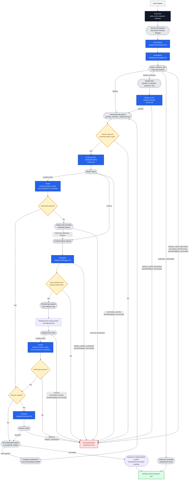

# Pi Nested Loop

Project-local prompts and agent definitions for supervising coding tasks in
[pi](https://github.com/badlogic/pi-mono). The subagent runtime is provided by
[pi-subagents](https://github.com/nicobailon/pi-subagents); this repository
contains only its orchestration prompt, task contract, and role definitions.

## Contents

| Path | Purpose |
| --- | --- |
| `.pi/prompts/supervise.md` | `/supervise` policy and final-completion prompt |
| `.pi/agents/orchestrator.md` | Routes the specialist workflow and returns verifier-backed checkpoints |
| `.pi/agents/investigator.md` | Read-only repository investigation and task routing |
| `.pi/agents/design-worker.md` | Read-only resolution of architectural decisions |
| `.pi/agents/coding-worker.md` | Implementation of one bounded outcome |
| `.pi/agents/verifier.md` | Independent per-packet contract and design-conformance verification |
| `.pi/agents/debugger.md` | Read-only diagnosis of a failed implementation attempt |
| `.pi/agents/reviewer.md` | Read-only review of a verified patch |
| `.pi/TASK_PACKET_TEMPLATE.md` | Handoff contract for implementation tasks |
| `assets/agent-orchestration.png` | Orchestration diagram asset (legacy) |

## Orchestration flow



No model, provider, concurrency, or extension settings are checked in. Configure
them in the pi environment. The role definitions require subagents to run
sequentially, in the foreground, with fresh context. The only permitted
delegation hierarchy is supervisor → orchestrator → leaf specialist.

## Requirements

- pi with project-local prompts and agents enabled
- a model provider configured in pi
- the `pi-subagents` extension
- a trusted target repository with concrete verification commands

Install the extension:

```bash
pi install npm:pi-subagents
```

Extensions run with the permissions of the pi process. Review third-party
extensions before installing them.

## Setup

```bash
git clone https://github.com/nobody-qwert/pi_agents.git
cd pi_agents
pi
```

To use this setup in another repository, copy `.pi`. The role prompts are
self-contained and inherit that repository's own `AGENTS.md` or `CLAUDE.md`
when present. Keep repository-specific module boundaries, protected paths,
constraints, and verification commands in the target repository's instructions.

## Usage

From the configured repository root:

```text
/supervise <task and acceptance criteria>
```

The supervisor:

1. Records the Git baseline and treats pre-existing changes as protected.
2. Invokes the orchestrator once to route all specialist work.
3. Independently checks the final diff and reruns every command in the
   orchestrator's verification manifest before accepting completion.
4. Returns the verified result or a concrete blocker.

The orchestrator:

1. Runs the investigator and, only when needed, the design worker.
2. Sends ready task packets to coding workers sequentially.
3. Sends each completed packet to the verifier, which checks the implementation
   against its task packet and design decision and runs its exact acceptance
   commands before dependent work begins.
4. Runs the reviewer after verifier acceptance for large, risky,
   public-interface, or cross-responsibility changes.
5. On a worker or verifier failure, permits one debugger and at most one
   replacement coding worker when the diagnosis supplies a materially different
   experiment.

## Task packets

Each packet defines:

- one observable `GOAL` and its `ACCEPTANCE_CRITERIA`;
- `EXPECTED_PATHS` as informed starting points, not an exhaustive allowlist;
- strict `PROTECTED_PATHS` that must not change;
- verified `ENTRY_SYMBOLS` and task dependencies;
- exact `ACCEPTANCE_COMMANDS`;
- constraints, known facts, and fingerprints of failed approaches.

The coding worker may change paths outside `EXPECTED_PATHS` when required by the
same outcome, but must return `BLOCKED_SCOPE` if the outcome must broaden or a
protected path must change.

## Boundaries

- Existing uncommitted changes are human-owned.
- Workers must not weaken tests, bypass checks, or perform unrelated cleanup.
- Investigator, design, verifier, debugger, and reviewer roles are non-editing by
  instruction, not by a filesystem sandbox.
- Leaf agent definitions set fresh context and prohibit subagents. The
  orchestrator is the only delegating agent; all execution remains sequential,
  foreground, and unscheduled.
- Deterministic timeouts, filesystem isolation, and process enforcement require
  the extension or an external sandbox.
