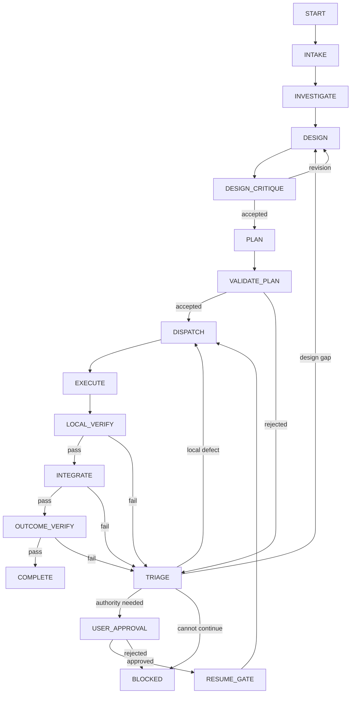
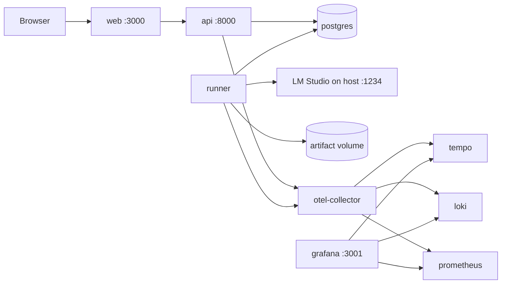

# Technical Implementation Plan

Status: draft for iteration
Target: a locally runnable Docker Compose vertical slice that can evolve into a
production deployment

## 1. Product Outcome

Build a standalone web application where a user can submit substantial work to
a deterministic multi-agent workflow and observe exactly how that work moves
through the system.

The first usable slice must let a user:

1. Open a graph view of all agent stages and permitted transitions.
2. Hover over a node to see its purpose, prompt preview, model, tools, timeout,
   retry limit, input schema, and output schema.
3. Click a node to inspect its full versioned configuration and prompt.
4. Start a conversation and submit a work request.
5. Watch the active graph node and progress update in real time.
6. Expand every agent call, tool call, validation, transition, and approval step.
7. Reload the browser and replay the run from durable events.
8. Follow a trace link into the observability dashboard.
9. Start the complete local stack with `docker compose up --build`.

The first slice demonstrates wiring, state transitions, UI behavior, persistence,
and observability. It does not need to implement arbitrary real-world work or
production-grade autonomous tools yet.

## 2. Reference Interaction Pattern

The [nobody-qwert/doc-chat](https://github.com/nobody-qwert/doc-chat)
application provides a useful interaction pattern:

- FastAPI returns a streaming NDJSON response.
- Events distinguish live steps, answer tokens, final metadata, and errors.
- The React client consumes the response incrementally.
- Pipeline steps are upserted as they move from `started` to `done` or `error`.
- A pipeline summary expands into individual steps.
- Individual steps expand into structured inputs, outputs, prompts, tool
  arguments/results, errors, and timing data.

This application should retain that clarity while changing the underlying
contract in three ways:

- events are written durably before being streamed;
- a client can reconnect from its last event sequence;
- the UI distinguishes domain events from raw OpenTelemetry data.

The chat timeline is the operator-friendly explanation of a run. OpenTelemetry
is the engineering trace. Authoritative database records are the audit source of
truth.

## 3. Decisive Architecture Choices

### 3.1 Runtime

- Python 3.12 or later.
- LangGraph for the fixed, checkpointed control graph.
- Pydantic v2 for strict input, proposal, result, event, and record schemas.
- FastAPI for HTTP APIs and server-sent event streaming.
- A separate runner process executes graph work; API request handlers never own
  long-running runs.
- PostgreSQL stores authoritative records, LangGraph checkpoints, conversations,
  and the durable event stream.
- Object/artifact storage is represented by an interface. The local slice uses a
  Docker volume; a later production adapter can use S3-compatible storage.

### 3.2 Frontend

- React with TypeScript and Vite.
- React Flow for the graph canvas.
- ELK.js for deterministic automatic graph layout.
- TanStack Query for API state and cache invalidation.
- A small typed SSE client for resumable live events.
- Markdown rendering with HTML disabled or strictly sanitized.
- Component-local styling initially; select a design system only after the
  information architecture stabilizes.

### 3.3 Observability

- OpenTelemetry SDKs in the API and runner.
- OpenTelemetry Collector as the only export boundary.
- Grafana for the local observability UI.
- Tempo for traces, Loki for structured operational logs, and Prometheus for
  metrics in the full local profile.
- Domain run events remain in PostgreSQL and are displayed directly by the app.

### 3.4 Model boundary

- An internal `ModelGateway` protocol isolates LangGraph nodes from a specific
  provider SDK.
- The required adapter targets LM Studio's OpenAI-compatible endpoint.
- The runtime model is `qwen3.6-27b`, 27B parameters, using the locally loaded
  `Q4_K_M` four-bit quantization shown in LM Studio.
- Startup readiness queries LM Studio's model endpoint and rejects execution
  when the configured model ID is not loaded.
- Provider credentials remain server-side and are never returned by the graph or
  agent configuration endpoints.
- There is no fake-model runtime mode or silent provider fallback. Unit tests may
  mock the `ModelGateway` boundary, but Compose demonstrations and end-to-end
  workflow tests call the configured LM Studio server.

## 4. Fixed Control Graph

The production graph is declared in Python and compiled at application startup.
Agents do not add executable nodes or edges.



This diagram is not maintained separately in the frontend. The backend exports
the compiled registry and permitted edges through an API; the same data drives
the UI graph and transition tests.

### 4.1 Dynamic work without dynamic topology

The planner may propose a variable work graph containing systems, work packages,
leaf tasks, integration tasks, verification tasks, and dependencies. That graph
is data stored in `work_nodes` and `work_edges`.

The fixed `DISPATCH -> EXECUTE -> LOCAL_VERIFY` section processes approved ready
nodes until none remain. The control graph does not compile arbitrary code from
the proposed work graph.

### 4.2 Transition ownership

Each edge maps to a deterministic transition function. The function accepts
current state plus a validated result type and returns either one permitted next
state or a rejection. Free-form text is never a transition selector.

Examples:

```text
validate_plan(ValidatedPlan) -> PLAN_ACCEPTED | PLAN_REJECTED
accept_verification(VerificationReport) -> VERIFIED | TRIAGE_REQUIRED
apply_approval(ApprovalRecord) -> RESUME_GATE | BLOCKED
complete_run(OutcomeEvidence) -> COMPLETE | TRIAGE_REQUIRED
```

## 5. Agent Registry and Configuration

Agent definitions are versioned application configuration, not Python modules
with unrestricted access.

Proposed layout:

```text
config/
  agents/
    intake.yaml
    investigator.yaml
    design-authority.yaml
    design-critic.yaml
    work-planner.yaml
    executor.yaml
    local-verifier.yaml
    integrator.yaml
    outcome-verifier.yaml
    issue-triager.yaml
  prompts/
    intake.md
    investigator.md
    design-authority.md
    design-critic.md
    work-planner.md
    executor.md
    local-verifier.md
    integrator.md
    outcome-verifier.md
    issue-triager.md
```

Minimum agent configuration schema:

```yaml
schema_version: 1
agent_id: design-authority
display_name: Design Authority
description: Produces a bounded versioned design proposal.
prompt_ref: prompts/design-authority.md
model:
  provider: lm-studio
  model: qwen3.6-27b
  temperature: 0.1
  max_output_tokens: 6000
execution:
  timeout_seconds: 180
  max_attempts: 2
  allow_parallel: false
tools: []
input_schema: DesignRequest
output_schema: DesignProposal
authority:
  can_propose_design: true
  can_accept_design: false
  can_mutate_artifacts: false
  can_complete_run: false
visibility:
  expose_prompt_to_operator: true
```

At startup, the registry:

1. Loads and validates every YAML definition.
2. Resolves and hashes the prompt file.
3. Rejects unknown tools, schemas, privileges, or duplicate agent IDs.
4. Creates an immutable registry version.
5. Exposes a redacted UI projection.
6. Pins each run and node attempt to the registry and prompt hashes it used.

### 5.1 Graph-node inspection behavior

Hover cards show concise information that can be read without covering the
graph:

- role and description;
- prompt title plus the first few lines;
- provider/model and main generation settings;
- tool names;
- timeout/retry policy;
- input/output schema names;
- authority badges.

Clicking a node opens a side panel containing the full permitted view: prompt,
settings, schema JSON, tools, transition conditions, configuration hash, and
current-run status. Secret values and hidden policy instructions are never sent
to the browser.

## 6. Backend Services and Boundaries

```text
API layer
  -> application services
      -> graph coordinator
      -> run/conversation service
      -> registry projection service
      -> approval service
      -> event service
  -> ports
      -> PostgreSQL repositories
      -> checkpoint saver
      -> artifact store
      -> model gateway
      -> tool gateway
      -> telemetry exporter
```

### 6.1 API service

Owns authentication boundary, request validation, chat/run queries, approval
commands, graph/config projections, and SSE delivery. It does not execute graph
nodes.

### 6.2 Runner service

Claims queued run work, invokes LangGraph, calls model/tool adapters, validates
agent results, writes checkpoints and domain records, and emits durable events.
Only one lease holder may execute a run at a time.

### 6.3 Transition service

Owns the allowed transition table, optimistic concurrency checks, state version
increments, idempotency keys, and transition audit records. Both the coordinator
and approval service must use this boundary.

### 6.4 Plan validator

Validates unique IDs, known node/role types, allowed depth and node count,
parent references, acyclic dependencies, criterion coverage, interface
producers/consumers, leaf readiness, protected artifacts, and authority limits.

### 6.5 Event service

Writes a domain event in the same database transaction as its associated state
change. Each run has a monotonically increasing `sequence`. PostgreSQL
`LISTEN/NOTIFY` wakes connected SSE handlers; polling is the recovery fallback.

### 6.6 Artifact service

Is the sole boundary for reading or writing deliverable artifacts. It validates
logical artifact IDs, size/type policy, access scope, expected version, and
content hash. Workers do not receive arbitrary host filesystem access.

## 7. Durable Data Model

Initial PostgreSQL tables:

| Table | Purpose |
| --- | --- |
| `users` | authenticated operator identity |
| `conversations` | chat container and ownership |
| `messages` | user, assistant, and system messages |
| `runs` | outcome request, graph state, version, status, budgets |
| `run_events` | ordered durable UI/audit event stream |
| `agent_registry_versions` | immutable loaded registry snapshot |
| `agent_attempts` | agent input/result references, status, usage, trace ID |
| `design_revisions` | immutable design versions and acceptance state |
| `work_nodes` | proposed/approved work-node records and state |
| `work_edges` | dependency/interface edges between work nodes |
| `packets` | immutable version-pinned worker handoffs |
| `artifacts` | artifact metadata, hash, storage locator, access policy |
| `evidence` | verifier results linked to criteria and artifacts |
| `issues` | classified findings, routing, and impact set |
| `approvals` | authenticated decisions and authority scope |
| `transition_log` | previous/next state, reason, actor, record version |
| LangGraph checkpoint tables | framework-managed durable execution state |

Large prompts, model outputs, tool results, and artifacts are stored through the
artifact interface when they exceed the inline/event size limit. Database rows
carry hashes and references.

## 8. Event and Streaming Contract

The UI consumes one normalized event envelope:

```json
{
  "schema_version": 1,
  "event_id": "evt_...",
  "run_id": "run_...",
  "conversation_id": "conv_...",
  "sequence": 42,
  "occurred_at": "2026-07-16T08:00:00Z",
  "type": "agent.completed",
  "stage": "DESIGN",
  "node_id": "design-authority",
  "work_node_id": null,
  "attempt_id": "attempt_...",
  "status": "completed",
  "summary": "Design proposal produced",
  "detail_ref": "/api/v1/runs/run_.../events/evt_.../detail",
  "trace_id": "...",
  "span_id": "..."
}
```

Core event types:

```text
run.created                 run.started
run.paused                  run.completed
run.blocked                 run.failed
stage.entered               stage.exited
agent.started               agent.token
agent.completed             agent.failed
tool.requested              tool.started
tool.completed              tool.failed
validation.started          validation.rejected
validation.accepted         transition.applied
work_node.proposed          work_node.ready
work_node.started           work_node.verified
design.revised              work_node.invalidated
approval.requested          approval.recorded
artifact.created            evidence.recorded
```

### 8.1 SSE behavior

Endpoint:

```text
GET /api/v1/runs/{run_id}/events
Accept: text/event-stream
Last-Event-ID: <last sequence received>
```

The server first replays events after the supplied sequence and then tails live
events. It sends heartbeats, applies authorization on reconnect, and ends only
after the run reaches a terminal state or the client disconnects. Large detail
payloads are fetched lazily through `detail_ref` when the user expands a step.

SSE is preferred over a single streaming POST because runs outlive individual
HTTP requests and browser sessions. WebSockets are unnecessary for the first
slice; approvals and chat messages use ordinary commands while SSE carries
server events.

### 8.2 Event detail views

Expandable event details are typed by event category:

- Agent call: agent/config version, prompt snapshot or permitted prompt view,
  structured input/output, model settings, tokens, cost, latency, validation,
  retry/failure information, trace link.
- Tool call: tool version, validated arguments, permission decision, result or
  artifact reference, duration, exit/error state, trace link.
- Validation: schema errors, policy rule IDs, accepted record version, rejected
  fields, next permitted action.
- Transition: previous/next state, deterministic condition, record versions,
  idempotency key, actor.
- Approval: requested authority, affected versions, authenticated decision,
  comment, expiration.
- Artifact/evidence: logical identity, version, hash, producer, criterion links,
  safe preview, access policy.

Raw chain-of-thought is never requested or displayed. The UI shows prompts,
structured inputs/outputs, tool activity, summaries, and explicit decision
reasons that the system is permitted to retain.

## 9. HTTP API

Initial API surface:

```text
GET    /health
GET    /ready

GET    /api/v1/system/graph
GET    /api/v1/system/agents
GET    /api/v1/system/agents/{agent_id}

POST   /api/v1/conversations
GET    /api/v1/conversations
GET    /api/v1/conversations/{conversation_id}
POST   /api/v1/conversations/{conversation_id}/messages

POST   /api/v1/runs
GET    /api/v1/runs/{run_id}
POST   /api/v1/runs/{run_id}/cancel
GET    /api/v1/runs/{run_id}/events
GET    /api/v1/runs/{run_id}/events/{event_id}/detail
GET    /api/v1/runs/{run_id}/work-graph

GET    /api/v1/runs/{run_id}/approvals
POST   /api/v1/runs/{run_id}/approvals/{approval_id}/decisions

GET    /api/v1/runs/{run_id}/artifacts
GET    /api/v1/artifacts/{artifact_id}
```

`POST /messages` may either continue ordinary conversation or request a new run.
The response includes the durable message and run IDs; live output arrives over
the run event stream.

## 10. Frontend Information Architecture

### 10.1 Main shell

The application has three primary views:

- Workspace: conversation and live run timeline.
- Graph: static control graph with optional current-run overlay.
- Runs: searchable run history, status, duration, cost, issues, and evidence.

A right-side inspector is shared by graph nodes, execution events, work nodes,
artifacts, and approvals.

### 10.2 Chat workspace

The main column shows user and assistant messages. A run started from a user
message inserts a pipeline card directly below that message.

The collapsed pipeline card shows:

- current stage and human-readable activity;
- overall run status;
- elapsed time and optional cost/token counters;
- completed/total work nodes;
- blocking approval or error state.

Expanding it shows chronological execution events. Each row has an icon for
agent, tool, validator, transition, approval, or artifact; status; label;
duration; and timestamp. Selecting a row opens typed details.

Assistant answer tokens can stream into a message while execution events update
independently. Reconnection must not duplicate either content or events.

### 10.3 Graph view

The base graph shows fixed stages and conditional edges. During a run:

- the active stage is highlighted;
- completed stages show pass/fail status and duration;
- the traversed path is emphasized;
- pending approval and blocked stages have distinct states;
- clicking a stage filters the timeline to its attempts;
- a toggle switches between the static control graph and approved dynamic work
  graph.

Hover is a preview, not the only access path. All information must remain
keyboard accessible through focus and the inspector panel.

### 10.4 Trace and log experience

The app provides the domain-oriented run history. An operator can click a trace
ID to open the corresponding Grafana/Tempo trace. The trace shows API request,
runner stage, agent call, model request, tool call, validation, repository write,
and event publication spans.

The app should not attempt to recreate a full observability backend. It surfaces
correlated summaries and deep-links for engineering investigation.

## 11. Docker Compose Topology



Compose services:

| Service | Responsibility |
| --- | --- |
| `web` | builds/serves React application and proxies `/api` in local mode |
| `api` | FastAPI commands, queries, registry projection, SSE |
| `runner` | LangGraph execution and durable event production |
| `postgres` | authoritative state, event log, checkpoints |
| `otel-collector` | receives OTLP and routes telemetry |
| `tempo` | trace storage |
| `loki` | structured log storage |
| `prometheus` | metric storage/scraping |
| `grafana` | pre-provisioned local dashboards and trace/log exploration |

Named volumes hold PostgreSQL data, artifacts, and observability data. Health
checks and `depends_on.condition: service_healthy` prevent runner startup before
the database is ready. Images run as non-root users where supported.

LM Studio runs on the host rather than in this Compose project. The `api` and
`runner` services map `host.docker.internal` to Docker's `host-gateway` for Linux
compatibility. LM Studio must listen on an interface reachable from Docker; a
server bound exclusively to `127.0.0.1` may not be reachable from Linux
containers. The documented setup should use LM Studio's network-access setting
or an explicitly configured host address, protected by the host firewall.

### 11.1 Local configuration

`.env.example` documents:

```text
APP_ENV=development
APP_BASE_URL=http://localhost:3000
DATABASE_URL=postgresql+asyncpg://...
MODEL_PROVIDER=lm-studio
LM_STUDIO_BASE_URL=http://host.docker.internal:1234/v1
LM_STUDIO_API_KEY=lm-studio
LM_STUDIO_MODEL_ID=qwen3.6-27b
OTEL_EXPORTER_OTLP_ENDPOINT=http://otel-collector:4317
OTEL_CONTENT_CAPTURE=false
ARTIFACT_ROOT=/var/lib/orchestrator/artifacts
```

Secrets are supplied at runtime and excluded from images and Git. LM Studio does
not normally require a real API secret for its local OpenAI-compatible endpoint;
the configured placeholder remains server-side. Failure to reach LM Studio or
find the configured model makes readiness fail with an actionable diagnostic.

## 12. Repository Layout

```text
backend/
  Dockerfile
  pyproject.toml
  migrations/
  src/orchestrator/
    api/
    application/
    graph/
    schemas/
    services/
    repositories/
    adapters/
    telemetry/
    policies/
  tests/
    unit/
    integration/
    adversarial/
frontend/
  Dockerfile
  package.json
  src/
    api/
    components/
    features/chat/
    features/graph/
    features/runs/
    features/trace/
    types/
observability/
  otel-collector.yaml
  tempo.yaml
  loki.yaml
  prometheus.yaml
  grafana/provisioning/
config/
  agents/
  prompts/
docker-compose.yml
.env.example
PLAN.md
TECHNICAL_DETAILS.md
README.md
```

## 13. Security and Safety Requirements

- Authenticate every API operation before real multi-user deployment.
- Authorize conversations, runs, events, artifacts, and approvals by tenant and
  user role.
- Never send provider secrets, hidden credentials, or unrestricted internal
  policy to the browser.
- Sanitize Markdown and disable arbitrary HTML/script execution.
- Validate tool calls against an allowlisted tool registry and per-agent policy.
- Run dangerous tools in a separate sandbox service; no host Docker socket.
- Apply request, event-stream, model, token, tool, artifact-size, and run budgets.
- Redact or omit protected content before logs and OTel export.
- Encrypt production transport and sensitive persistent data.
- Record immutable approval and transition evidence.
- Treat prompts and model/tool responses as untrusted data, including prompt
  injection embedded in user-provided documents.

## 14. Verification Strategy

### 14.1 Unit tests

- schema strictness and version migrations;
- transition-table completeness and forbidden edges;
- graph registry/config validation;
- work-graph DAG and coverage validation;
- leaf-readiness and authority checks;
- event serialization and redaction;
- idempotent command and retry behavior.

### 14.2 Integration tests

- API plus PostgreSQL repositories;
- LangGraph checkpoint, crash, and resume;
- runner lease and duplicate-delivery behavior;
- state change plus event transaction atomicity;
- SSE initial replay, live tail, reconnect, and terminal close;
- approval pause/resume and stale approval rejection;
- artifact version conflicts and access control;
- OTLP export with content capture disabled.

### 14.3 Frontend tests

- graph renders backend registry and conditional edges;
- hover/focus preview and click inspector;
- pipeline event upsert from started to terminal state;
- nested event detail expansion;
- SSE reconnection without duplicates;
- approval and failure states;
- keyboard navigation and accessible labels.

### 14.4 End-to-end vertical-slice test

Using the required LM Studio Qwen model:

1. Start the Compose stack.
2. Wait for health/readiness gates.
3. Open the workspace and verify the fixed graph.
4. Submit a predefined work request.
5. Observe deterministic traversal with at least one agent call, tool call,
   validation, and final response.
6. Expand each step and verify typed details.
7. Reload during execution and resume from the last event sequence.
8. Verify the completed run and trace are visible after restart.

## 15. Implementation Work Packages

### WP-1: schemas and fixed graph registry

Outcome: versioned schemas, agent registry loader, fixed graph declaration, and
transition table pass unit tests without a model or database.

### WP-2: persistence and durable events

Outcome: PostgreSQL repositories atomically persist run transitions and ordered
events; replay and idempotency tests pass.

### WP-3: runner and LM Studio vertical slice

Outcome: the runner executes the fixed graph through LM Studio with validated
typed agent responses, persists checkpoints, and survives process interruption.

### WP-4: command/query API and SSE

Outcome: conversations and runs can be created, queried, cancelled, approved,
and followed through a reconnectable event stream.

### WP-5: graph/config UI

Outcome: the backend-defined graph renders with hover previews, full node
inspection, and live run-state overlay.

### WP-6: chat and expandable execution UI

Outcome: users submit work, see streamed progress/answer content, expand typed
events, reload, and continue from durable state.

### WP-7: OpenTelemetry and local dashboards

Outcome: API/runner traces, safe logs, and metrics arrive through the collector;
the app deep-links runs and attempts to Grafana.

### WP-8: model hardening and policy gates

Outcome: LM Studio model calls are instrumented, bounded, retried only by policy,
and malformed or unsafe agent output is rejected visibly without changing graph
logic.

### WP-9: hardening and first pilot

Outcome: adversarial, recovery, accessibility, and end-to-end checks pass for a
bounded software-domain pilot.

Work packages are ordered by dependency, but each should be decomposed into
smaller independently verifiable tasks before implementation.

## 16. First Milestone Acceptance Criteria

The Dockerized vertical slice is complete when:

- one command starts all required local services from a clean checkout;
- the UI graph comes from the backend registry and shows only permitted edges;
- every graph node exposes a safe prompt/config preview and complete operator
  inspector;
- a user can submit a request and receive a durable run ID;
- the UI displays live, replayable, expandable agent/tool/validation events;
- refresh/reconnect does not lose or duplicate events;
- the LM Studio-backed workflow reaches completion only through deterministic
  transition services;
- invalid agent output produces a visible rejected-validation event;
- PostgreSQL and runner restart tests demonstrate resume;
- traces, logs, and metrics are visible in the local observability stack;
- no external developer-agent runtime is required.

## 17. Open Design Decisions

These should be resolved before implementing their owning work package:

1. Authentication for the local slice: development identity header versus a
   minimal local login.
2. Runner wake-up: PostgreSQL queue/notification only versus a dedicated task
   broker when horizontal scale is introduced.
3. Artifact backend: local volume only in milestone one versus including MinIO
   in the default Compose stack.
4. Agent configuration editing: read-only UI initially versus draft/edit/publish
   workflow in the first release.
5. Prompt visibility: full prompt for administrators only versus all local
   operators in single-user mode.
6. OTel content policy: hashes/references only by default, with per-run debug
   capture as an explicit short-lived option.
7. Whether Grafana/Loki/Tempo/Prometheus run by default or behind a Compose
   `observability` profile for lighter startup.

Recommended first choices: development identity header, PostgreSQL-backed runner
leases and notifications, local artifact volume, read-only agent configuration,
administrator-only full prompts in production, content capture disabled by
default, and the full observability stack enabled in the documented demo command.
