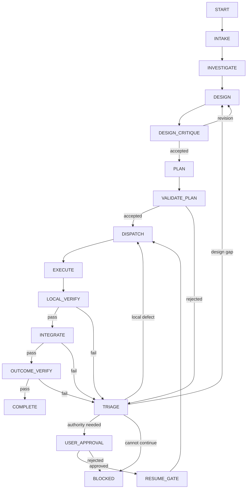
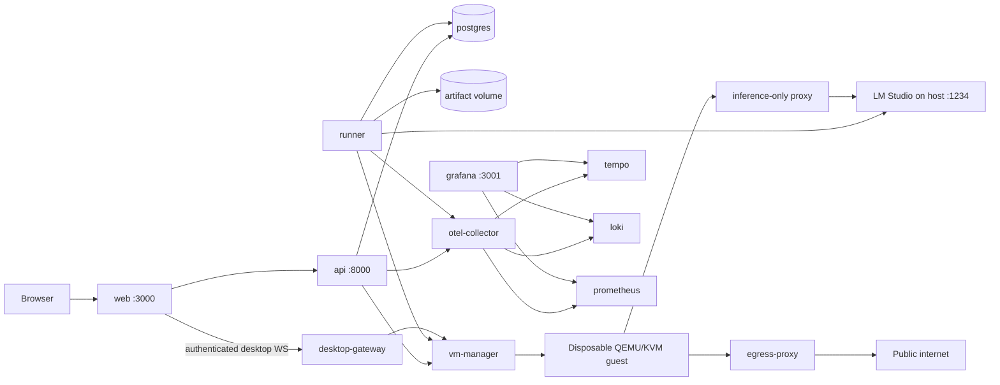

# Technical Implementation Plan

Status: draft for iteration
Target: a locally runnable Docker Compose vertical slice that can evolve into a
production deployment

## 1. Product Outcome

Build a standalone web application where a user can submit substantial work to
a deterministic multi-agent workflow and observe exactly how that work moves
through the system.

The first usable slice must let a user:

1. Open a graph view of all agent stages and permitted transitions.
2. Hover over a node to see its purpose, prompt preview, model, tools, timeout,
   retry limit, input schema, and output schema.
3. Click a node to inspect its full versioned configuration and prompt.
4. Select an allowlisted host folder and copy it into a fresh disposable VM.
5. Start a conversation and submit a work request against that copied workspace.
6. Watch the active graph node and progress update in real time.
7. Open the guest desktop, interact with Chromium, and take or return input
   control without exposing the host desktop.
8. Expand every agent call, tool call, validation, transition, and approval step.
9. Restore the guest workspace to a recorded Git checkpoint.
10. Review a good result and explicitly promote it as a user-confirmed version
    commit on a new host Git branch.
11. Reload the browser and replay the run from durable events.
12. Follow a trace link into the observability dashboard.
13. Start the complete local stack with `docker compose up --build`.

The first slice demonstrates wiring, state transitions, UI behavior, persistence,
and observability. It does not need to implement arbitrary real-world work or
production-grade autonomous tools yet.

## 2. Reference Interaction Pattern

The [nobody-qwert/doc-chat](https://github.com/nobody-qwert/doc-chat)
application provides a useful interaction pattern:

- FastAPI returns a streaming NDJSON response.
- Events distinguish live steps, answer tokens, final metadata, and errors.
- The React client consumes the response incrementally.
- Pipeline steps are upserted as they move from `started` to `done` or `error`.
- A pipeline summary expands into individual steps.
- Individual steps expand into structured inputs, outputs, prompts, tool
  arguments/results, errors, and timing data.

This application should retain that clarity while changing the underlying
contract in three ways:

- events are written durably before being streamed;
- a client can reconnect from its last event sequence;
- the UI distinguishes domain events from raw OpenTelemetry data.

The chat timeline is the operator-friendly explanation of a run. OpenTelemetry
is the engineering trace. Authoritative database records are the audit source of
truth.

## 3. Decisive Architecture Choices

### 3.1 Runtime

- Python 3.12 or later.
- LangGraph for the fixed, checkpointed control graph.
- Pydantic v2 for strict input, proposal, result, event, and record schemas.
- FastAPI for HTTP APIs and server-sent event streaming.
- A separate runner process executes graph work; API request handlers never own
  long-running runs.
- PostgreSQL stores authoritative records, LangGraph checkpoints, conversations,
  and the durable event stream.
- Object/artifact storage is represented by an interface. The local slice uses a
  Docker volume; a later production adapter can use S3-compatible storage.

### 3.2 Frontend

- React with TypeScript and Vite.
- React Flow for the graph canvas.
- ELK.js for deterministic automatic graph layout.
- TanStack Query for API state and cache invalidation.
- A small typed SSE client for resumable live events.
- Markdown rendering with HTML disabled or strictly sanitized.
- Component-local styling initially; select a design system only after the
  information architecture stabilizes.

### 3.3 Observability

- OpenTelemetry SDKs in the API and runner.
- OpenTelemetry Collector as the only export boundary.
- Grafana for the local observability UI.
- Tempo for traces, Loki for structured operational logs, and Prometheus for
  metrics in the full local profile.
- Domain run events remain in PostgreSQL and are displayed directly by the app.

### 3.4 Model boundary

- An internal `ModelGateway` protocol isolates LangGraph nodes from a specific
  provider SDK.
- The required adapter targets LM Studio's OpenAI-compatible endpoint.
- The runtime model is `qwen3.6-27b`, 27B parameters, using the locally loaded
  `Q4_K_M` four-bit quantization shown in LM Studio.
- Startup readiness queries LM Studio's model endpoint and rejects execution
  when the configured model ID is not loaded.
- Provider credentials remain server-side and are never returned by the graph or
  agent configuration endpoints.
- There is no fake-model runtime mode or silent provider fallback. Unit tests may
  mock the `ModelGateway` boundary, but Compose demonstrations and end-to-end
  workflow tests call the configured LM Studio server.

### 3.5 Disposable execution boundary

- Docker Compose hosts the trusted API, runner, persistence, telemetry, egress,
  and VM-management control plane.
- A QEMU/KVM guest with an immutable base image and a per-run QCOW2 overlay hosts
  every model-directed filesystem, shell, build, test, and browser operation.
- The VM-manager container receives `/dev/kvm`, the VM storage root, read-only
  allowlisted project roots, and a writable review/export root. It exposes only
  typed lifecycle and transfer operations, never a generic host-shell endpoint.
- The selected source folder is copied into
  `/home/piagent/workspaces/<run-id>/<project>`; it is never mounted into the
  guest and the agent never receives a writable host path.
- The guest runs as non-root `piagent` without sudo, host SSH-agent forwarding,
  host credentials, a Docker socket, or host filesystem sharing.
- One guest is run-scoped in the first release. It survives bounded leaf-task
  attempts and is destroyed after promotion, explicit cancellation, or result
  export according to retention policy.

### 3.6 Pi-compatible guest tools

- A `GuestAgentRuntime` adapter uses Pi's SDK or RPC protocol inside the guest;
  the first implementation should prefer the SDK for direct session, tool, and
  event control.
- Built-in-compatible tools include `read`, `write`, `edit`, `bash`, `grep`,
  `find`, and `ls`, rooted at the guest workspace.
- Per-role allowlists are authoritative: planners receive no mutation tools,
  implementers receive scoped mutation tools, and verifiers receive read and
  bounded-check tools only.
- Chromium and Playwright are installed in the sealed guest image. Typed browser
  tools expose navigation, accessibility snapshots, clicks, text input,
  screenshots, console output, and network failures.
- Pi extensions and packages are version-pinned and audited while building the
  base image. Their in-process permissions remain contained by the guest and do
  not replace application policy validation.

### 3.7 Guest network and interactive desktop

- Internet access uses a policy-controlled HTTP/HTTPS egress proxy. It denies
  loopback, host, RFC1918, link-local, metadata, reserved, and LM Studio
  management destinations and records bounded per-run destination metadata.
- LM Studio is exposed through a separate inference-only proxy or tunnel with an
  explicit route allowlist.
- Chromium runs on a guest virtual display exposed through KasmVNC or noVNC.
  The application authenticates a short-lived WebSocket session and embeds the
  screen in the workspace UI; it never exposes a raw VNC listener publicly.
- Clipboard integration, host file transfer, microphone, camera, and host
  browser-profile sharing are disabled by default.
- Input ownership is explicit. `AGENT`, `USER`, and `PAUSED` are deterministic
  states; taking manual control pauses browser automation before user input is
  accepted, and returning control records a durable event.

### 3.8 Guest Git and host promotion

- Copy-in excludes the source `.git` directory by default. The checkpoint
  service initializes a separate guest repository and creates a baseline commit
  after import.
- Accepted work creates service-owned checkpoint commits containing the run,
  work-node, attempt, design, and evidence identifiers. Rollback creates a new
  lineage event instead of deleting earlier checkpoint records.
- Guest Git supports recovery but is not authoritative; durable records retain
  tree hashes and evidence even if the guest repository is damaged.
- A promotion preview exports to a staging directory and shows the complete
  diff, changed-file manifest, checks, unresolved issues, source baseline,
  destination branch, commit message, and proposed version.
- The UI proposes the next minor semantic version only when the repository has a
  valid version-tag baseline: `v<major>.<minor>.<patch>` becomes
  `v<major>.<minor+1>.0`. The authenticated user may edit and must confirm the
  exact label.
- Confirmed promotion revalidates the source HEAD and cleanliness, creates an
  isolated host Git worktree and `orchestrator/<version>-<run-id>` branch,
  applies the exported result, reruns required promotion checks, and creates one
  commit plus an optional unique annotated tag. It never changes the user's
  current checkout.
- A dirty, advanced, non-Git, conflicting, or failed-validation source is not
  mutated. The export is committed into a separate result repository for manual
  review instead.
- Promotion applies a manifest-checked delta between the sanitized import
  baseline and selected guest checkpoint. Excluded or protected host paths
  cannot be modified or inferred as deletions.

## 4. Fixed Control Graph

The production graph is declared in Python and compiled at application startup.
Agents do not add executable nodes or edges.



This diagram is not maintained separately in the frontend. The backend exports
the compiled registry and permitted edges through an API; the same data drives
the UI graph and transition tests.

### 4.1 Dynamic work without dynamic topology

The planner may propose a variable work graph containing systems, work packages,
leaf tasks, integration tasks, verification tasks, and dependencies. That graph
is data stored in `work_nodes` and `work_edges`.

The fixed `DISPATCH -> EXECUTE -> LOCAL_VERIFY` section processes approved ready
nodes until none remain. The control graph does not compile arbitrary code from
the proposed work graph.

### 4.2 Transition ownership

Each edge maps to a deterministic transition function. The function accepts
current state plus a validated result type and returns either one permitted next
state or a rejection. Free-form text is never a transition selector.

Examples:

```text
validate_plan(ValidatedPlan) -> PLAN_ACCEPTED | PLAN_REJECTED
accept_verification(VerificationReport) -> VERIFIED | TRIAGE_REQUIRED
apply_approval(ApprovalRecord) -> RESUME_GATE | BLOCKED
complete_run(OutcomeEvidence) -> COMPLETE | TRIAGE_REQUIRED
```

## 5. Agent Registry and Configuration

Agent definitions are versioned application configuration, not Python modules
with unrestricted access.

Proposed layout:

```text
config/
  agents/
    intake.yaml
    investigator.yaml
    design-authority.yaml
    design-critic.yaml
    work-planner.yaml
    executor.yaml
    local-verifier.yaml
    integrator.yaml
    outcome-verifier.yaml
    issue-triager.yaml
  prompts/
    intake.md
    investigator.md
    design-authority.md
    design-critic.md
    work-planner.md
    executor.md
    local-verifier.md
    integrator.md
    outcome-verifier.md
    issue-triager.md
```

Minimum agent configuration schema:

```yaml
schema_version: 1
agent_id: design-authority
display_name: Design Authority
description: Produces a bounded versioned design proposal.
prompt_ref: prompts/design-authority.md
model:
  provider: lm-studio
  model: qwen3.6-27b
  temperature: 0.1
  max_output_tokens: 6000
execution:
  timeout_seconds: 180
  max_attempts: 2
  allow_parallel: false
tools: []
input_schema: DesignRequest
output_schema: DesignProposal
authority:
  can_propose_design: true
  can_accept_design: false
  can_mutate_artifacts: false
  can_complete_run: false
visibility:
  expose_prompt_to_operator: true
```

At startup, the registry:

1. Loads and validates every YAML definition.
2. Resolves and hashes the prompt file.
3. Rejects unknown tools, schemas, privileges, or duplicate agent IDs.
4. Creates an immutable registry version.
5. Exposes a redacted UI projection.
6. Pins each run and node attempt to the registry and prompt hashes it used.

### 5.1 Graph-node inspection behavior

Hover cards show concise information that can be read without covering the
graph:

- role and description;
- prompt title plus the first few lines;
- provider/model and main generation settings;
- tool names;
- timeout/retry policy;
- input/output schema names;
- authority badges.

Clicking a node opens a side panel containing the full permitted view: prompt,
settings, schema JSON, tools, transition conditions, configuration hash, and
current-run status. Secret values and hidden policy instructions are never sent
to the browser.

## 6. Backend Services and Boundaries

```text
API layer
  -> application services
      -> graph coordinator
      -> run/conversation service
      -> registry projection service
      -> approval service
      -> event service
      -> workspace/checkpoint service
      -> promotion service
  -> ports
      -> PostgreSQL repositories
      -> checkpoint saver
      -> artifact store
      -> model gateway
      -> tool gateway
      -> VM manager
      -> guest agent runtime
      -> egress policy gateway
      -> telemetry exporter
```

### 6.1 API service

Owns authentication boundary, request validation, chat/run queries, approval
commands, graph/config projections, and SSE delivery. It does not execute graph
nodes.

### 6.2 Runner service

Claims queued run work, invokes LangGraph, calls model/tool adapters, validates
agent results, writes checkpoints and domain records, and emits durable events.
Only one lease holder may execute a run at a time.

### 6.3 Transition service

Owns the allowed transition table, optimistic concurrency checks, state version
increments, idempotency keys, and transition audit records. Both the coordinator
and approval service must use this boundary.

### 6.4 Plan validator

Validates unique IDs, known node/role types, allowed depth and node count,
parent references, acyclic dependencies, criterion coverage, interface
producers/consumers, leaf readiness, protected artifacts, and authority limits.

### 6.5 Event service

Writes a domain event in the same database transaction as its associated state
change. Each run has a monotonically increasing `sequence`. PostgreSQL
`LISTEN/NOTIFY` wakes connected SSE handlers; polling is the recovery fallback.

### 6.6 Artifact service

Is the sole boundary for reading or writing deliverable artifacts. It validates
logical artifact IDs, size/type policy, access scope, expected version, and
content hash. Workers do not receive arbitrary host filesystem access.
Guest workspace mutations are provisional execution state; only validated
copy-out through this service creates an authoritative artifact version.

### 6.7 VM and workspace service

Owns allowlisted project discovery, source fingerprinting, sanitized copy-in,
run-scoped VM creation, SSH/control-channel readiness, preview tunnels, desktop
session tokens, copy-out, and guest destruction. The VM manager accepts typed
operations and validated identifiers only. The runner sends tool requests to the
guest runtime through this service; neither the model nor browser can address
the VM-manager host process directly.

### 6.8 Checkpoint service

Initializes the separate guest Git repository, creates the baseline and accepted
work-node commits, validates commit/tree hashes, lists restorable checkpoints,
and performs idempotent rollback. It cannot promote to the host or mark a work
node verified.

### 6.9 Promotion service

Builds an immutable export preview, proposes a version label, validates an
authenticated confirmation, rechecks the recorded host baseline, creates an
isolated Git worktree and branch, applies the export, runs required checks, and
records the resulting commit and optional tag. It never runs model-supplied Git
commands and never modifies the user's current checkout.

## 7. Durable Data Model

Initial PostgreSQL tables:

| Table | Purpose |
| --- | --- |
| `users` | authenticated operator identity |
| `conversations` | chat container and ownership |
| `messages` | user, assistant, and system messages |
| `runs` | outcome request, graph state, version, status, budgets |
| `run_events` | ordered durable UI/audit event stream |
| `agent_registry_versions` | immutable loaded registry snapshot |
| `agent_attempts` | agent input/result references, status, usage, trace ID |
| `workspace_sessions` | selected source, source fingerprint, VM/overlay identity, lifecycle and input owner |
| `workspace_checkpoints` | guest commit/tree hash, work node, evidence, parent and rollback lineage |
| `workspace_transfers` | sanitized copy-in/copy-out manifest, exclusions, hashes, status |
| `promotion_previews` | immutable exported diff, manifest, checks, proposed target/version |
| `promotions` | authenticated decision, idempotency key, branch, commit, tag, result |
| `design_revisions` | immutable design versions and acceptance state |
| `work_nodes` | proposed/approved work-node records and state |
| `work_edges` | dependency/interface edges between work nodes |
| `packets` | immutable version-pinned worker handoffs |
| `artifacts` | artifact metadata, hash, storage locator, access policy |
| `evidence` | verifier results linked to criteria and artifacts |
| `issues` | classified findings, routing, and impact set |
| `approvals` | authenticated decisions and authority scope |
| `transition_log` | previous/next state, reason, actor, record version |
| LangGraph checkpoint tables | framework-managed durable execution state |

Large prompts, model outputs, tool results, and artifacts are stored through the
artifact interface when they exceed the inline/event size limit. Database rows
carry hashes and references.

## 8. Event and Streaming Contract

The UI consumes one normalized event envelope:

```json
{
  "schema_version": 1,
  "event_id": "evt_...",
  "run_id": "run_...",
  "conversation_id": "conv_...",
  "sequence": 42,
  "occurred_at": "2026-07-16T08:00:00Z",
  "type": "agent.completed",
  "stage": "DESIGN",
  "node_id": "design-authority",
  "work_node_id": null,
  "attempt_id": "attempt_...",
  "status": "completed",
  "summary": "Design proposal produced",
  "detail_ref": "/api/v1/runs/run_.../events/evt_.../detail",
  "trace_id": "...",
  "span_id": "..."
}
```

Core event types:

```text
run.created                 run.started
run.paused                  run.completed
run.blocked                 run.failed
stage.entered               stage.exited
agent.started               agent.token
agent.completed             agent.failed
tool.requested              tool.started
tool.completed              tool.failed
validation.started          validation.rejected
validation.accepted         transition.applied
work_node.proposed          work_node.ready
work_node.started           work_node.verified
design.revised              work_node.invalidated
approval.requested          approval.recorded
artifact.created            evidence.recorded
workspace.selected          workspace.imported
workspace.checkpointed      workspace.rolled_back
vm.started                  vm.ready
vm.input_owner_changed      vm.destroyed
promotion.previewed         promotion.confirmed
promotion.committed         promotion.rejected
```

### 8.1 SSE behavior

Endpoint:

```text
GET /api/v1/runs/{run_id}/events
Accept: text/event-stream
Last-Event-ID: <last sequence received>
```

The server first replays events after the supplied sequence and then tails live
events. It sends heartbeats, applies authorization on reconnect, and ends only
after the run reaches a terminal state or the client disconnects. Large detail
payloads are fetched lazily through `detail_ref` when the user expands a step.

SSE is preferred over a single streaming POST because runs outlive individual
HTTP requests and browser sessions. Approvals and chat messages use ordinary
commands while SSE carries server events. WebSockets are reserved for the
interactive guest display and are not used as a second run-event transport.

### 8.2 Event detail views

Expandable event details are typed by event category:

- Agent call: agent/config version, prompt snapshot or permitted prompt view,
  structured input/output, model settings, tokens, cost, latency, validation,
  retry/failure information, trace link.
- Tool call: tool version, validated arguments, permission decision, result or
  artifact reference, duration, exit/error state, trace link.
- Validation: schema errors, policy rule IDs, accepted record version, rejected
  fields, next permitted action.
- Transition: previous/next state, deterministic condition, record versions,
  idempotency key, actor.
- Approval: requested authority, affected versions, authenticated decision,
  comment, expiration.
- Artifact/evidence: logical identity, version, hash, producer, criterion links,
  safe preview, access policy.
- Workspace/checkpoint: sanitized source identity, source fingerprint, guest
  path, checkpoint commit/tree hash, lineage, rollback actor, and current input
  owner.
- Promotion: immutable diff/manifest reference, baseline comparison, confirmed
  version, destination worktree/branch, check results, commit/tag, and rejection
  reason.

Raw chain-of-thought is never requested or displayed. The UI shows prompts,
structured inputs/outputs, tool activity, summaries, and explicit decision
reasons that the system is permitted to retain.

## 9. HTTP API

Initial API surface:

```text
GET    /health
GET    /ready

GET    /api/v1/system/graph
GET    /api/v1/system/agents
GET    /api/v1/system/agents/{agent_id}

GET    /api/v1/projects
GET    /api/v1/projects/{project_id}

POST   /api/v1/conversations
GET    /api/v1/conversations
GET    /api/v1/conversations/{conversation_id}
POST   /api/v1/conversations/{conversation_id}/messages

POST   /api/v1/runs
GET    /api/v1/runs/{run_id}
POST   /api/v1/runs/{run_id}/cancel
GET    /api/v1/runs/{run_id}/events
GET    /api/v1/runs/{run_id}/events/{event_id}/detail
GET    /api/v1/runs/{run_id}/work-graph
GET    /api/v1/runs/{run_id}/workspace
GET    /api/v1/runs/{run_id}/workspace/checkpoints
POST   /api/v1/runs/{run_id}/workspace/checkpoints
POST   /api/v1/runs/{run_id}/workspace/checkpoints/{checkpoint_id}/rollback
POST   /api/v1/runs/{run_id}/workspace/desktop-sessions
POST   /api/v1/runs/{run_id}/workspace/input-owner
GET    /api/v1/runs/{run_id}/workspace/previews

GET    /api/v1/runs/{run_id}/approvals
POST   /api/v1/runs/{run_id}/approvals/{approval_id}/decisions

GET    /api/v1/runs/{run_id}/artifacts
GET    /api/v1/artifacts/{artifact_id}

GET    /api/v1/runs/{run_id}/promotions
POST   /api/v1/runs/{run_id}/promotion-previews
POST   /api/v1/runs/{run_id}/promotions
```

`POST /messages` may either continue ordinary conversation or request a new run.
The response includes the durable message and run IDs; live output arrives over
the run event stream.

`GET /projects` returns opaque selections discovered only under configured host
roots. Run creation accepts a `project_id`, never an arbitrary client-supplied
absolute path. Promotion creation references an immutable preview and carries
the authenticated user's exact version, commit message, tag choice, and
confirmation nonce.

## 10. Frontend Information Architecture

### 10.1 Main shell

The application has four primary views:

- Workspace: conversation and live run timeline.
- Graph: static control graph with optional current-run overlay.
- VM Desktop: interactive guest screen, previews, checkpoints, and input owner.
- Runs: searchable run history, status, duration, cost, issues, and evidence.

A right-side inspector is shared by graph nodes, execution events, work nodes,
artifacts, and approvals.

### 10.2 Chat workspace

The main column shows user and assistant messages. A run started from a user
message inserts a pipeline card directly below that message.

Before the first run, the user selects a project from a server-provided folder
browser rooted at configured allowlists. The start form previews the source
path, Git HEAD and cleanliness, copy exclusions, estimated size, and whether
direct Git promotion will be eligible. Starting the run creates the guest,
copies the snapshot, initializes the separate guest Git baseline, and only then
enables work submission.

The collapsed pipeline card shows:

- current stage and human-readable activity;
- overall run status;
- elapsed time and optional cost/token counters;
- completed/total work nodes;
- blocking approval or error state.

Expanding it shows chronological execution events. Each row has an icon for
agent, tool, validator, transition, approval, or artifact; status; label;
duration; and timestamp. Selecting a row opens typed details.

Assistant answer tokens can stream into a message while execution events update
independently. Reconnection must not duplicate either content or events.

### 10.3 Graph view

The base graph shows fixed stages and conditional edges. During a run:

- the active stage is highlighted;
- completed stages show pass/fail status and duration;
- the traversed path is emphasized;
- pending approval and blocked stages have distinct states;
- clicking a stage filters the timeline to its attempts;
- a toggle switches between the static control graph and approved dynamic work
  graph.

Hover is a preview, not the only access path. All information must remain
keyboard accessible through focus and the inspector panel.

### 10.4 Trace and log experience

The app provides the domain-oriented run history. An operator can click a trace
ID to open the corresponding Grafana/Tempo trace. The trace shows API request,
runner stage, agent call, model request, tool call, validation, repository write,
and event publication spans.

The app should not attempt to recreate a full observability backend. It surfaces
correlated summaries and deep-links for engineering investigation.

### 10.5 VM desktop and web previews

The VM Desktop view embeds the guest display through an authenticated
KasmVNC/noVNC WebSocket proxy. It shows VM/SSH/browser health, egress mode,
active preview ports, input owner, and connection expiration. A `Take control`
action first transitions input ownership from `AGENT` to `PAUSED` and then
`USER`; `Return to agent` reverses that sequence. Browser automation cannot
continue while the user owns input.

The VM manager opens localhost-bound SSH tunnels for validated guest application
ports. Preview links identify the run and port, expire with the VM session, and
do not expose arbitrary host ports. Clipboard and upload controls are disabled
unless separately approved.

### 10.6 Checkpoints and version promotion

The workspace inspector lists the guest baseline and accepted checkpoints with
their work node, time, tree hash, checks, and current marker. `Roll back` shows
the files that would change and requires confirmation; it affects only the
guest and remains visible as a lineage event.

The `Promote good version` action first pauses guest mutations, runs configured
checks, records a `USER_ACCEPTED` guest checkpoint, and creates a read-only
preview. The modal shows the full diff and manifest, acceptance evidence,
unresolved issues, recorded versus current source baseline, protected excluded
paths, target branch, editable commit message, and editable proposed minor
version. Confirmation is disabled on conflict or failed required checks.
Success displays the new host branch, commit, and tag, with instructions for
reviewing or merging it; the current host checkout is not switched or modified.

## 11. Docker Compose Topology



Compose services:

| Service | Responsibility |
| --- | --- |
| `web` | builds/serves React application and proxies `/api` in local mode |
| `api` | FastAPI commands, queries, registry projection, SSE |
| `runner` | LangGraph execution and durable event production |
| `vm-manager` | allowlisted copy-in/out, QEMU/KVM lifecycle, guest control channel, checkpoints, preview tunnels |
| `desktop-gateway` | authenticated short-lived WebSocket proxy to the active guest display |
| `egress-proxy` | policy-controlled guest HTTP/HTTPS access with private/host destination denial |
| `model-proxy` | inference-only LM Studio route allowlist for guest model calls |
| `postgres` | authoritative state, event log, checkpoints |
| `otel-collector` | receives OTLP and routes telemetry |
| `tempo` | trace storage |
| `loki` | structured log storage |
| `prometheus` | metric storage/scraping |
| `grafana` | pre-provisioned local dashboards and trace/log exploration |

Named volumes hold PostgreSQL data, artifacts, VM base/overlay data, staged
exports, and observability data. The VM manager also receives `/dev/kvm`,
read-only configured project roots, and a writable dedicated result root. No
guest receives those mounts. Health
checks and `depends_on.condition: service_healthy` prevent runner startup before
the database is ready. Images run as non-root users where supported.

LM Studio runs on the host rather than in this Compose project. The runner uses
a server-side model adapter, while the guest reaches only the inference-only
proxy through a dedicated tunnel. LM Studio should remain bound to host
loopback; the proxy explicitly permits required OpenAI-compatible inference and
model-readiness routes and denies native management routes.

The VM-manager container is trusted and Linux-specific. It uses host networking
only where required for localhost SSH/QMP forwarding, binds management endpoints
to loopback or a private Compose network, has no Docker socket, and runs QEMU as
the configured non-root host UID with KVM group access.

### 11.1 Local configuration

`.env.example` documents:

```text
APP_ENV=development
APP_BASE_URL=http://localhost:3000
DATABASE_URL=postgresql+asyncpg://...
MODEL_PROVIDER=lm-studio
LM_STUDIO_BASE_URL=http://host.docker.internal:1234/v1
LM_STUDIO_API_KEY=lm-studio
LM_STUDIO_MODEL_ID=qwen3.6-27b
OTEL_EXPORTER_OTLP_ENDPOINT=http://otel-collector:4317
OTEL_CONTENT_CAPTURE=false
ARTIFACT_ROOT=/var/lib/orchestrator/artifacts
PI_VM_ROOT=/var/lib/orchestrator/vms
PROJECT_ROOTS=/projects
RESULT_ROOT=/var/lib/orchestrator/results
GUEST_WORKSPACE_ROOT=/home/piagent/workspaces
GUEST_EGRESS_MODE=web-proxy
DESKTOP_SESSION_TTL_SECONDS=900
PROMOTION_BRANCH_PREFIX=orchestrator/
```

Secrets are supplied at runtime and excluded from images and Git. LM Studio does
not normally require a real API secret for its local OpenAI-compatible endpoint;
the configured placeholder remains server-side. Failure to reach LM Studio or
find the configured model makes readiness fail with an actionable diagnostic.

## 12. Repository Layout

```text
backend/
  Dockerfile
  pyproject.toml
  migrations/
  src/orchestrator/
    api/
    application/
    graph/
    schemas/
    services/
    repositories/
    adapters/
    telemetry/
    policies/
  tests/
    unit/
    integration/
    adversarial/
frontend/
  Dockerfile
  package.json
  src/
    api/
    components/
    features/chat/
    features/graph/
    features/runs/
    features/vm-desktop/
    features/promotion/
    features/trace/
    types/
vm-manager/
  Dockerfile
  src/
    lifecycle/
    transfer/
    checkpoints/
    promotion/
    desktop/
    egress/
observability/
  otel-collector.yaml
  tempo.yaml
  loki.yaml
  prometheus.yaml
  grafana/provisioning/
config/
  agents/
  prompts/
docs/
  design/
    PLAN.md
    TECHNICAL_DETAILS.md
  work-packets/
docker-compose.yml
.env.example
AGENTS.md
README.md
```

## 13. Security and Safety Requirements

- Authenticate every API operation before real multi-user deployment.
- Authorize conversations, runs, events, artifacts, and approvals by tenant and
  user role.
- Never send provider secrets, hidden credentials, or unrestricted internal
  policy to the browser.
- Sanitize Markdown and disable arbitrary HTML/script execution.
- Validate tool calls against an allowlisted tool registry and per-agent policy.
- Run dangerous tools only in the disposable guest; no host Docker socket,
  writable project mount, SSH-agent forwarding, sudo-capable guest user, or
  generic VM-manager command endpoint.
- Resolve selected projects against canonical configured roots and apply a
  default-deny copy manifest for `.git`, secrets, credentials, caches, and build
  output.
- Route guest web access through an egress policy that rejects host, private,
  link-local, metadata, reserved, and rebinding destinations.
- Authenticate desktop sessions with short-lived run-scoped tokens; disable
  clipboard and host file transfer by default and serialize input ownership.
- Require immutable preview, baseline recheck, user confirmation, isolated
  worktree, required checks, and idempotency before host Git promotion.
- Never switch or write the user's active checkout, and refuse direct promotion
  when the source baseline is dirty, stale, conflicting, or non-Git.
- Apply request, event-stream, model, token, tool, artifact-size, and run budgets.
- Redact or omit protected content before logs and OTel export.
- Encrypt production transport and sensitive persistent data.
- Record immutable approval and transition evidence.
- Treat prompts and model/tool responses as untrusted data, including prompt
  injection embedded in user-provided documents.

## 14. Verification Strategy

### 14.1 Unit tests

- schema strictness and version migrations;
- transition-table completeness and forbidden edges;
- graph registry/config validation;
- work-graph DAG and coverage validation;
- leaf-readiness and authority checks;
- project-root canonicalization and copy-exclusion policy;
- checkpoint lineage, rollback guards, and tree-hash validation;
- semantic-version proposal and promotion idempotency/conflict guards;
- desktop input-owner transition rules and token expiration;
- egress destination and DNS-rebinding policy;
- event serialization and redaction;
- idempotent command and retry behavior.

### 14.2 Integration tests

- API plus PostgreSQL repositories;
- LangGraph checkpoint, crash, and resume;
- runner lease and duplicate-delivery behavior;
- state change plus event transaction atomicity;
- SSE initial replay, live tail, reconnect, and terminal close;
- approval pause/resume and stale approval rejection;
- artifact version conflicts and access control;
- VM lifecycle, sanitized copy-in, separate guest Git baseline, export, and
  overlay destruction;
- guest-only tool execution with no writable host project mount;
- desktop token/authentication and exclusive user/agent input control;
- checkpoint restore followed by continued execution;
- promotion preview, isolated worktree commit/tag, duplicate request, dirty
  source, changed HEAD, and validation-failure behavior;
- OTLP export with content capture disabled.

### 14.3 Frontend tests

- graph renders backend registry and conditional edges;
- hover/focus preview and click inspector;
- pipeline event upsert from started to terminal state;
- nested event detail expansion;
- SSE reconnection without duplicates;
- allowlisted project selection and copy-policy preview;
- embedded desktop connection, expiration, reconnect, and take/return control;
- checkpoint list, rollback preview, and current-checkpoint update;
- promotion diff, editable version confirmation, success, and conflict states;
- approval and failure states;
- keyboard navigation and accessible labels.

### 14.4 End-to-end vertical-slice test

Using the required LM Studio Qwen model:

1. Start the Compose stack.
2. Wait for health/readiness gates.
3. Select a clean fixture Git project and verify its sanitized snapshot is
   copied into a fresh guest with a separate baseline Git commit.
4. Open the workspace and verify the fixed graph and interactive guest desktop.
5. Submit a predefined web-oriented work request.
6. Observe deterministic traversal with at least one guest agent call, tool call,
   validation, and final response.
7. Take and return desktop control, open the guest browser, and verify controlled
   public web access cannot reach denied host/private destinations.
8. Create a checkpoint, make another change, roll back, and continue the run.
9. Expand each step and verify typed details.
10. Reload during execution and resume from the last event sequence.
11. Preview and confirm a minor-version promotion; verify the new host branch,
    commit, and optional tag exist while the original checkout is unchanged.
12. Destroy the guest and verify the completed run, trace, promotion record, and
    exported evidence remain visible after restart.

## 15. Implementation Work Packages

### WP-1: schemas and fixed graph registry

Outcome: versioned schemas, agent registry loader, fixed graph declaration, and
transition table pass unit tests without a model or database.

### WP-2: persistence and durable events

Outcome: PostgreSQL repositories atomically persist run transitions and ordered
events; replay and idempotency tests pass.

### WP-3: disposable VM and workspace foundation

Outcome: an allowlisted project snapshot is copied into a fresh non-root KVM
guest, a separate guest Git baseline and restorable checkpoints are recorded,
tool execution cannot mutate the host project, and export destroys no source
state.

### WP-4: runner and LM Studio vertical slice

Outcome: the runner executes the fixed graph through LM Studio with validated
typed agent responses, delegates permitted Pi-compatible tools into the guest,
persists LangGraph checkpoints, and survives process interruption.

### WP-5: command/query API and SSE

Outcome: conversations and runs can be created, queried, cancelled, approved,
and followed through a reconnectable event stream.

### WP-6: graph/config UI

Outcome: the backend-defined graph renders with hover previews, full node
inspection, and live run-state overlay.

### WP-7: chat, VM desktop, and promotion UI

Outcome: users submit work, see streamed progress/answer content, expand typed
events, interact with the guest desktop, manage checkpoints, preview a result,
and promote a confirmed version without changing the current host checkout.

### WP-8: OpenTelemetry and local dashboards

Outcome: API/runner traces, safe logs, and metrics arrive through the collector;
the app deep-links runs and attempts to Grafana.

### WP-9: model, tool, egress, and promotion hardening

Outcome: LM Studio model calls are instrumented, bounded, retried only by policy,
malformed or unsafe agent output is rejected visibly, guest egress and desktop
access are constrained, and stale or unsafe promotion attempts cannot change
host Git.

### WP-10: hardening and first pilot

Outcome: adversarial, recovery, accessibility, and end-to-end checks pass for a
bounded software-domain pilot.

Work packages are ordered by dependency, but each should be decomposed into
smaller independently verifiable tasks before implementation.

## 16. First Milestone Acceptance Criteria

The Dockerized vertical slice is complete when:

- one command starts all required local services from a clean checkout;
- the UI graph comes from the backend registry and shows only permitted edges;
- every graph node exposes a safe prompt/config preview and complete operator
  inspector;
- a user can select only a folder under configured project roots, inspect its
  copy policy, and start from a sanitized snapshot in a fresh disposable guest;
- all model-directed file, shell, build, test, and browser actions occur inside
  the guest with no writable host project mount;
- the guest has a separate Git baseline, accepted checkpoints, and a verified
  rollback flow;
- the UI embeds the guest desktop, supports exclusive take/return control, and
  exposes localhost-bound application previews;
- the guest can reach public web resources through controlled egress while host,
  private, metadata, and LM Studio management destinations remain denied;
- a user can submit a request and receive a durable run ID;
- the UI displays live, replayable, expandable agent/tool/validation events;
- refresh/reconnect does not lose or duplicate events;
- the LM Studio-backed workflow reaches completion only through deterministic
  transition services;
- invalid agent output produces a visible rejected-validation event;
- PostgreSQL and runner restart tests demonstrate resume;
- a reviewed result can be promoted to a new branch and user-confirmed minor
  version commit/tag without switching or modifying the current host checkout;
- dirty, stale, conflicting, duplicate, and failed-validation promotion attempts
  are refused or routed to a separate review repository;
- traces, logs, and metrics are visible in the local observability stack;
- the required Pi-compatible guest runtime and browser tooling are installed in
  the sealed VM image; no developer-agent runtime is required on the host.

## 17. Open Design Decisions

These should be resolved before implementing their owning work package:

1. Authentication for the local slice: development identity header versus a
   minimal local login.
2. Runner wake-up: PostgreSQL queue/notification only versus a dedicated task
   broker when horizontal scale is introduced.
3. Artifact backend: local volume only in milestone one versus including MinIO
   in the default Compose stack.
4. Agent configuration editing: read-only UI initially versus draft/edit/publish
   workflow in the first release.
5. Prompt visibility: full prompt for administrators only versus all local
   operators in single-user mode.
6. OTel content policy: hashes/references only by default, with per-run debug
   capture as an explicit short-lived option.
7. Whether Grafana/Loki/Tempo/Prometheus run by default or behind a Compose
   `observability` profile for lighter startup.
8. Guest display implementation: noVNC for the first slice versus KasmVNC from
   the start.
9. Which public package registries and download-size limits are enabled in the
   default web-egress policy.
10. Fallback version labels for repositories without valid semantic-version
    tags.

Recommended first choices: development identity header, PostgreSQL-backed runner
leases and notifications, local artifact volume, read-only agent configuration,
administrator-only full prompts in production, content capture disabled by
default, the full observability stack enabled in the documented demo command,
noVNC initially, HTTP/HTTPS proxy egress with explicit registry policy, and a
user-confirmed `run-<date>-<short-id>` fallback when no semantic-version baseline
exists.
